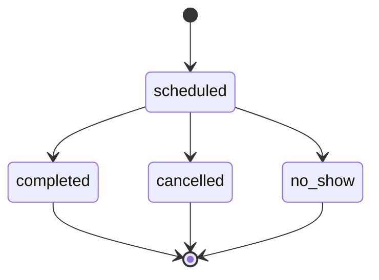

# Workflows — appointments

Status: [status_registry.md](../../shared_docs/status_registry.md#appointment-status-doctor-schedule)

## Slot booking flow

1. Patient/doctor requests slots (`APPOINTMENT_SLOTS_THROTTLE`)
2. Validate `MAX_BOOKING_DAYS`, `BOOKING_SLOT_LEAD_BUFFER_MINUTES`
3. Create appointment `scheduled`
4. Check-in → queue_management → consultations_core encounter

See [patient_journey.md](../../shared_docs/architecture/patient_journey.md).

## Validations

| Rule | Config |
|---|---|
| Max booking horizon | `MAX_BOOKING_DAYS` |
| Same-day lead buffer | `BOOKING_SLOT_LEAD_BUFFER_MINUTES` |
| Slot availability | Doctor working hours + clinic |
