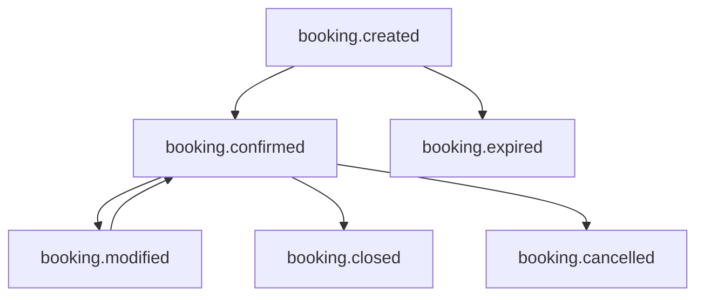

# Booking Workflow Model

## Operational lifecycle



## Happy path

```
booking.created (seq 1)
booking.confirmed (seq 2)
booking.modified (optional, slot/lab change)
booking.closed (order COMPLETED)
```

## Cancellation path

```
booking.created
booking.confirmed
booking.cancelled
```

## Expiration path

Celery beat task `expire_stale_bookings` (every 5 minutes):

1. Scans `DiagnosticOrder` in `CREATED` past `BOOKING_CONFIRMATION_TIMEOUT_MINUTES`
2. Scans `CONFIRMED` orders with `LabVisitAppointment` PENDING past slot date
3. Emits `booking.expired` once per booking

## Workflow identity

- **`workflow_instance_id` = `booking_id` = `DiagnosticOrder.id`**
- All lifecycle events share the same instance ID
- Retries and modifications reuse the same workflow instance

## Parent workflow propagation

When booking originates from a recommendation:

```
recommendation_id (parent) → booking_id (child)
```

Set via:

1. `LogContext.parent_workflow_instance_id` at order creation
2. Persisted on `DiagnosticOrder.operational_metadata.recommendation_id`
3. Recorded as `BusinessAudit.parent_workflow_instance_id`

## Correlation propagation

All events share `correlation_id` from `LogContext` for patient journey tracing across Clinical Audit, Business Audit, and application logs.

## Home collection

Home collection address and slot are captured in confirmed/modified payloads. No separate home-collection audit event in M4.3 (deferred to M4.8).

## Clinical boundary

| Clinical Audit | Business Audit |
|----------------|----------------|
| Test Ordered | Booking Created |
| Recommendation Sent | Booking Confirmed |
| Report Uploaded | Booking Modified/Cancelled/Expired/Closed |

Both systems complement one another; neither replaces the other.
