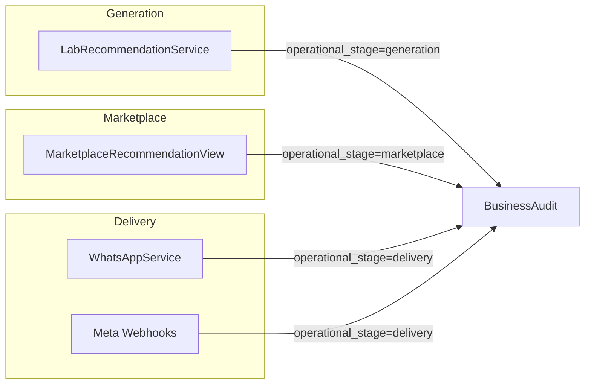

# Recommendation Workflow Model

## Three operational stages (CTO model)

Failures are attributed to the stage where they occurred:



Payload field `operational_stage` records the stage for every event.

## Lifecycle (happy path)

```
recommendation.generated (seq 1)
workflow.queued          (seq 2)
recommendation.sent      (seq 3)
recommendation.delivered (seq 4)
```

Optional: `recommendation.read` after delivery.

## Failure and retry path

```
recommendation.sent
recommendation.failed
recommendation.retried
recommendation.sent (retry)
recommendation.delivered
```

## Expiration path

Celery beat task `expire_stale_recommendations` (every 5 minutes):

1. Scans `WhatsAppMessage` with `message_type=TEST_BOOKING`
2. Compares `recommendation_metadata.expires_at` to now
3. Skips terminal statuses (Delivered, Read, Failed)
4. Emits `recommendation.expired` once per `recommendation_id`

## Workflow identity

- **`workflow_instance_id` = `recommendation_id`**
- Generated once at marketplace API request start or WhatsApp orchestrator run
- All retries reuse the same ID
- Set on `LogContext.workflow_instance_id` via `apply_workflow_context()`

## Correlation propagation

All events share `correlation_id` from `LogContext` for patient journey tracing across:

- Clinical Audit
- Business Audit
- Application logs
- Future Support Trace (Phase 5)

### Celery tasks

Pass and restore context at task boundaries:

```python
apply_workflow_context(workflow_instance_id=recommendation_id)
```

Retry audit uses message `request_payload.recommendation_id` to resolve workflow instance.

### Webhooks

Extract `recommendation_id` from `WhatsAppMessage.request_payload` and restore workflow context before emit.

## Entry points

| Path | recommendation_id source |
|------|-------------------------|
| Marketplace API | Generated at POST start |
| WhatsApp orchestrator | Generated after `recommend()` |
| Both share | Same `workflow_instance_id` semantics |

## Repository queries

```python
RecommendationAuditRepository().get_by_workflow(workflow_instance_id)
RecommendationAuditRepository().get_by_recommendation(recommendation_id)
RecommendationAuditRepository().get_by_consultation(consultation_id)
RecommendationAuditRepository().get_by_patient(patient_account_id)
RecommendationAuditRepository().get_by_provider_reference(meta_message_id)
```
