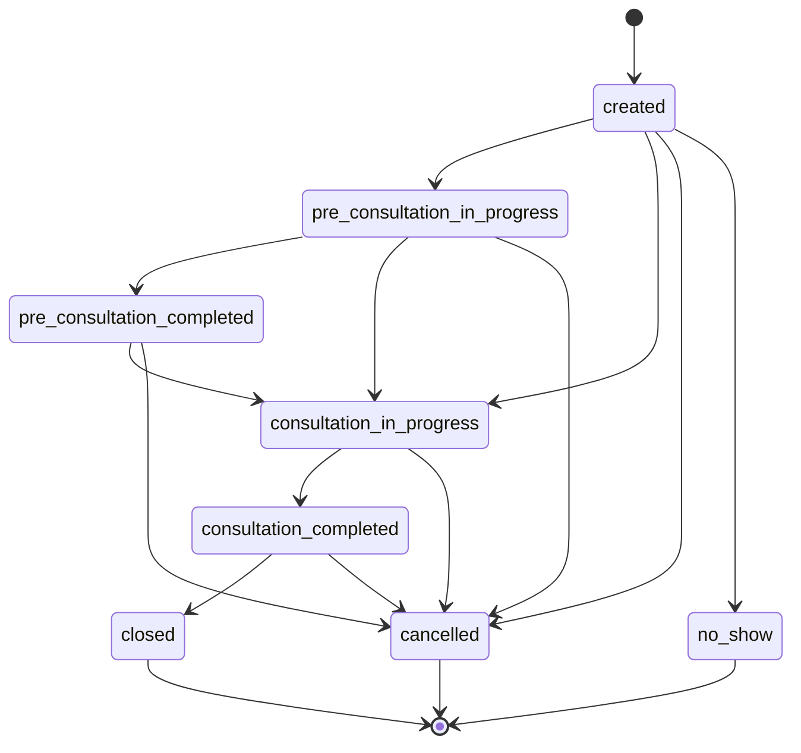
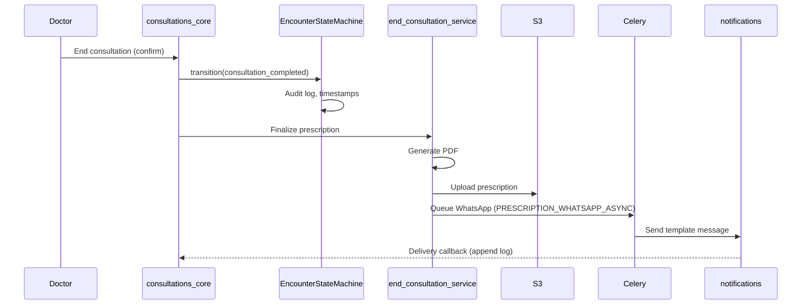
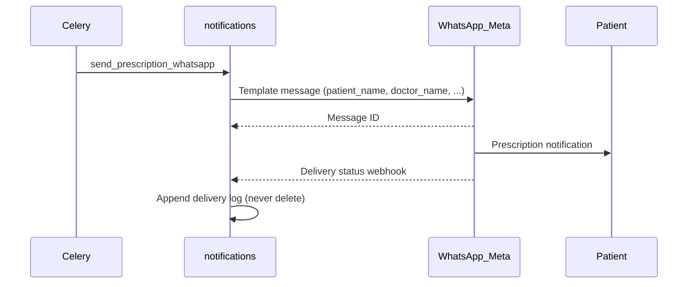
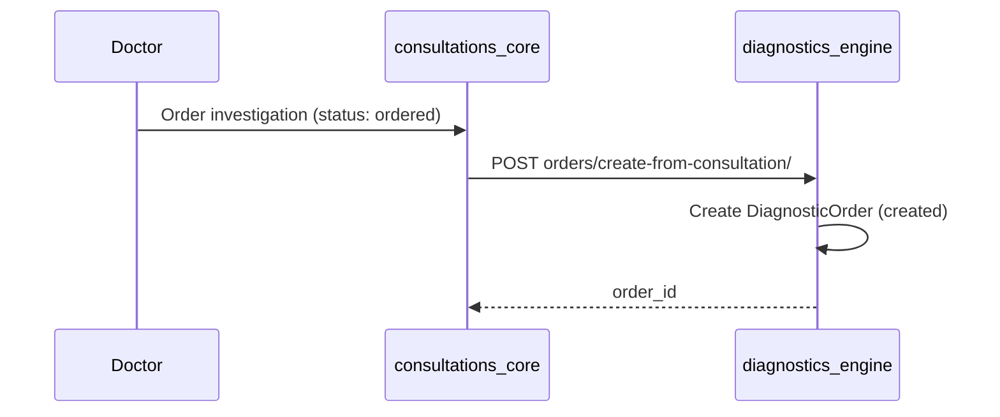

# Workflows — consultations_core

Statuses: [shared_docs/status_registry.md](../../shared_docs/status_registry.md#encounter-status).

## Encounter state machine

Controller: `EncounterStateMachine.transition()` — invalid transitions raise `ValidationError`.

## Sequence: Consultation completion

## Sequence: WhatsApp prescription delivery

Config: [CONFIGURATION.md](../../shared_docs/CONFIGURATION.md) — `WHATSAPP_*`, `PRESCRIPTION_WHATSAPP_ASYNC`.

## Sequence: Investigation → diagnostic order

## Prescription lifecycle

`draft` → `finalized` → (optional) `cancelled`. Finalized prescriptions trigger delivery pipeline.

## Queue sync

Terminal encounter states sync queue via `_sync_queue_for_encounter_terminal`.

## Future

- `closed` state for archival after consultation_completed
