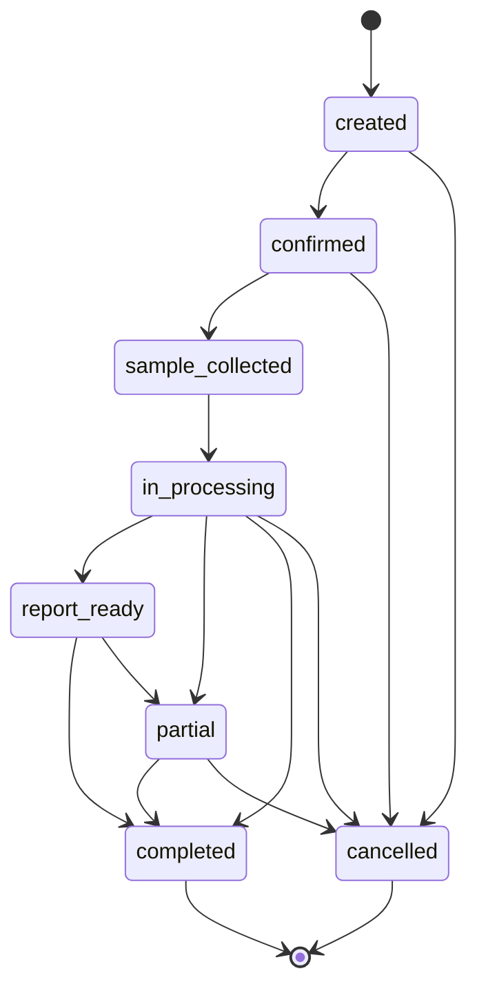
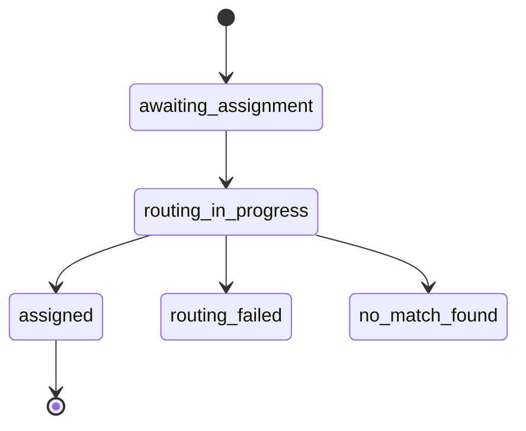
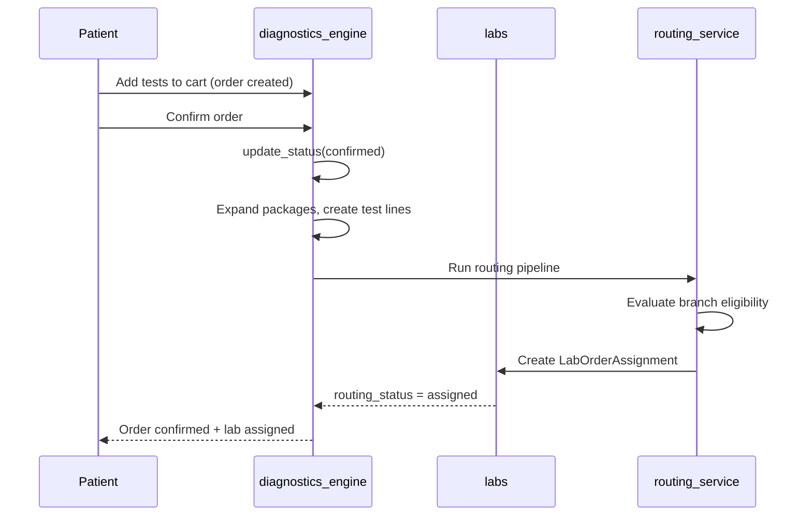
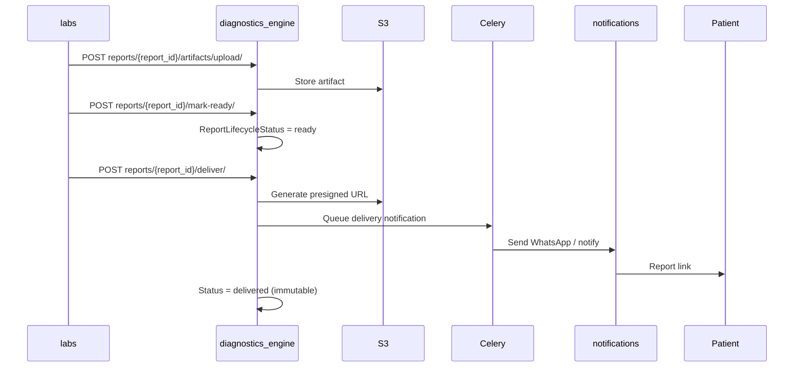

# Workflows — diagnostics_engine

Status definitions: [shared_docs/status_registry.md](../../shared_docs/status_registry.md). Do not duplicate enums here.

## Order status state machine

**Invalid transitions:** Any backward step (e.g., `confirmed` → `created`). Enforced in `DiagnosticOrder.update_status()`.

**Side effect on confirm:** Expands packages and creates `DiagnosticOrderTestLine` rows.

## Routing lifecycle

## Sequence: Test booking (cart → confirm → lab assign)

## Sequence: Report upload and delivery

## Report lifecycle

See [status_registry.md](../../shared_docs/status_registry.md#report-lifecycle-status): `pending` → `in_progress` → `ready` → `delivered`.

## Cancellation

`CancellationService`: package line cancel cascades to non-terminal test lines. Partial per-line cancel allowed before execution per product policy.

## Cross-app workflows

- Lab assignment acceptance: [labs/docs/WORKFLOWS.md](../../labs/docs/WORKFLOWS.md)
- Consultation investigation handoff: [consultations_core/docs/WORKFLOWS.md](../../consultations_core/docs/WORKFLOWS.md)

## Future stubs

- Payment workflow — not implemented
- Refund workflow — not implemented
