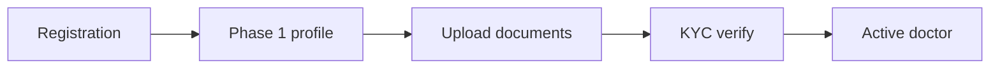
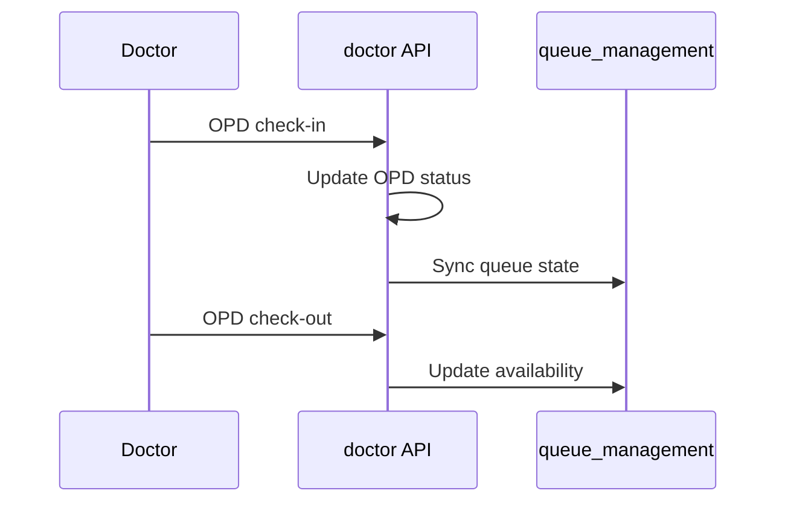

# Workflows — doctor

## KYC onboarding

## OPD check-in / check-out

## Scheduling

Working hours + leaves + rules → consumed by appointments for slot generation.

See [appointments/docs/WORKFLOWS.md](../../appointments/docs/WORKFLOWS.md).

## Dashboard

`/api/v1/doctors/` — summary metrics for doctor dashboard UI.
