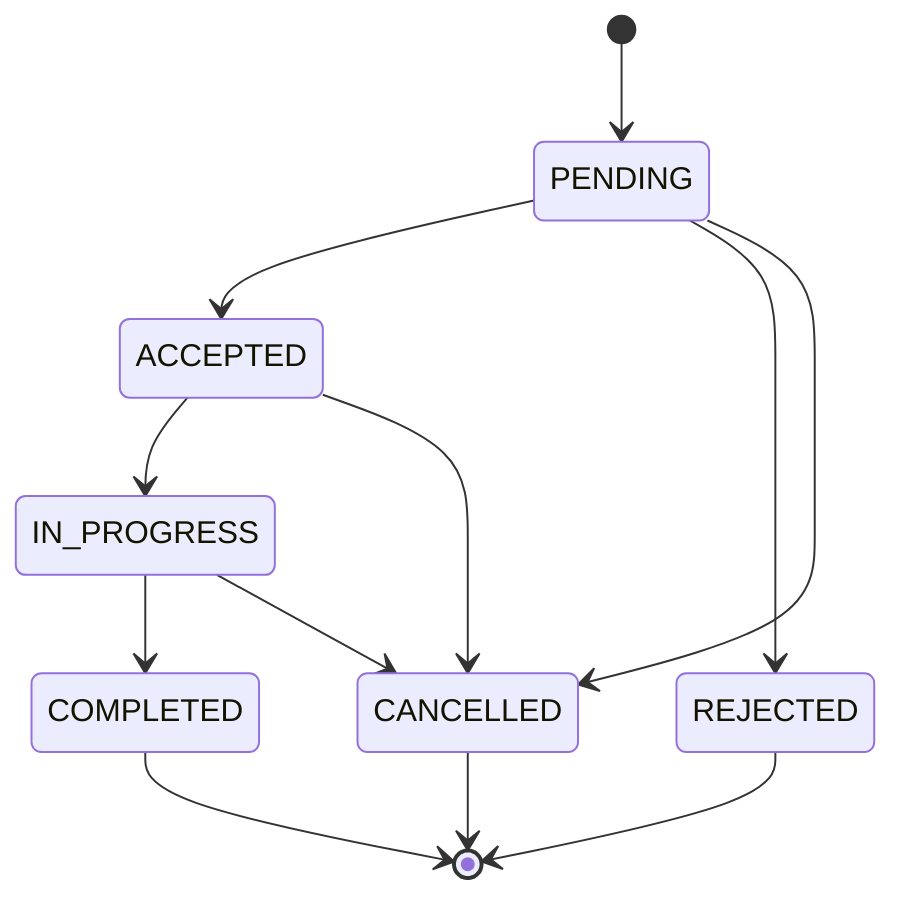
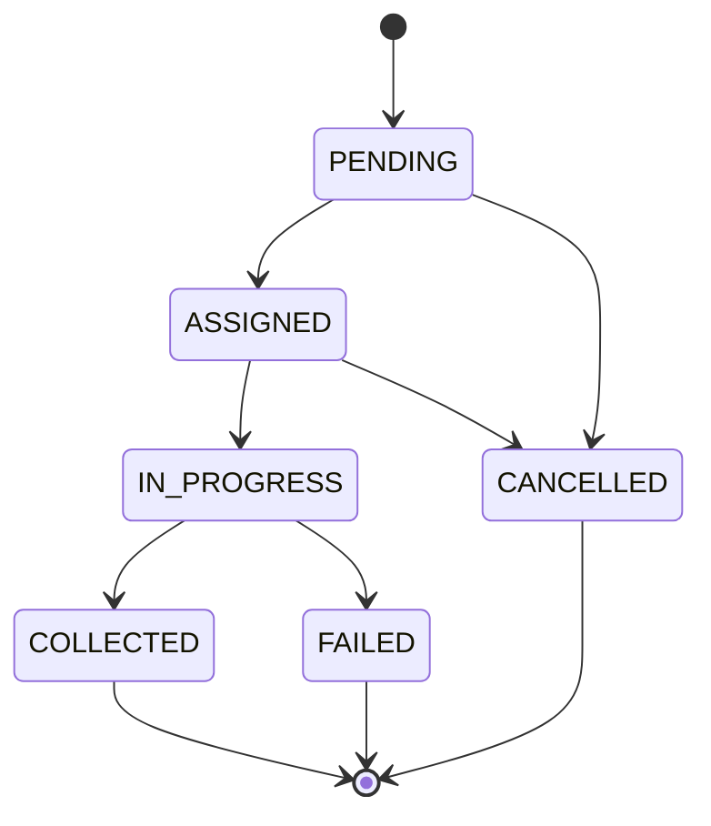
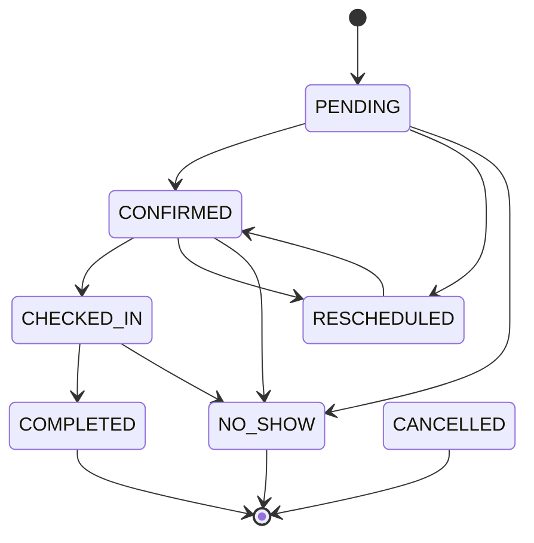
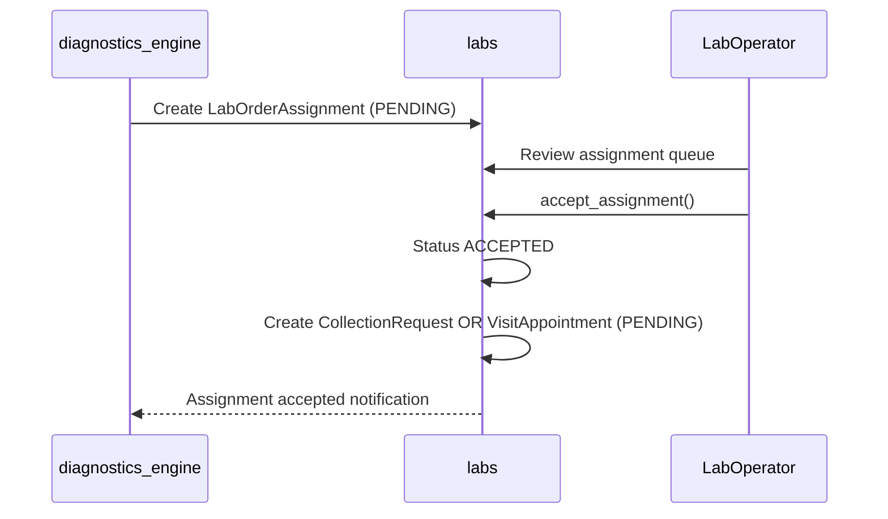
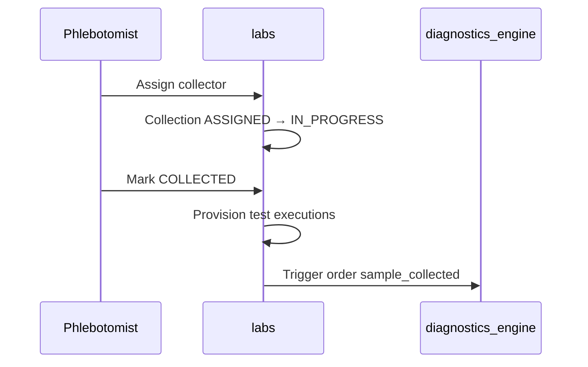
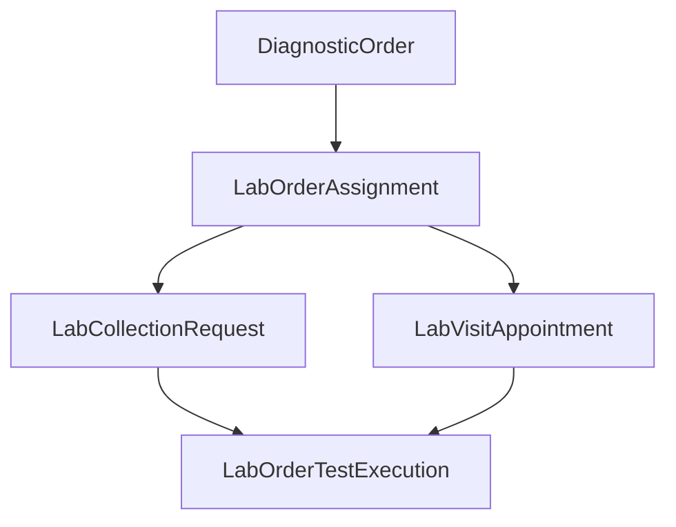

# Workflows — labs

Statuses: [shared_docs/status_registry.md](../../shared_docs/status_registry.md).

## Lab assignment state machine

Entry: `workflow_transitions.accept_assignment()`.

## Home collection state machine

Controller: `collection_workflow.py`

## Branch visit state machine

Controller: `visit_workflow.py`

**Side effect:** Test execution provisioning at check-in.

## Sequence: Lab assignment + acceptance

## Sequence: Home collection

## Layer diagram

## Legacy architecture docs

Detailed provisioning: former `documents/HOME_COLLECTION_PROVISIONING_ARCHITECTURE.md`, `TEST_EXECUTION_PROVISIONING_ARCHITECTURE.md` — summarized in [SERVICES.md](SERVICES.md).

## Operator manual

Lab pricing: `management/commands/lab_pricing_manual.md` — see [FAQ.md](FAQ.md).
