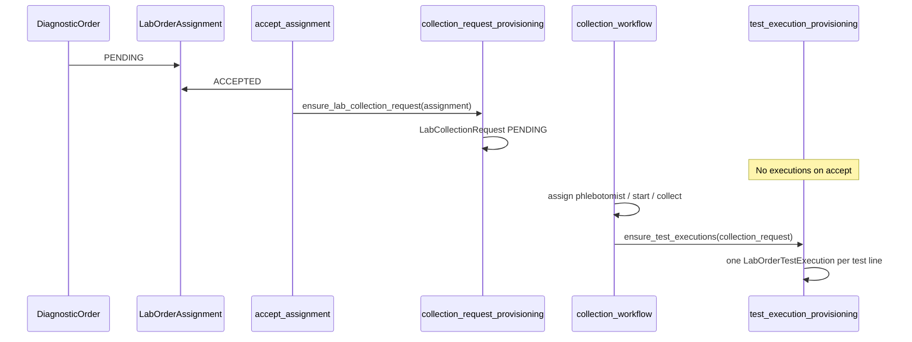

# Home Collection Provisioning Architecture

See also: [HOME_ORDER_ACCEPTANCE_WORKFLOW.md](./HOME_ORDER_ACCEPTANCE_WORKFLOW.md) (accept vs collect timing, three layers, anti-patterns).

## Purpose

`labs/services/collection_request_provisioning.py` owns **order-level home collection logistics** only.

It creates and idempotently ensures `LabCollectionRequest` rows. It does **not** create test executions, change assignment status, run collection transitions, or touch reports.

## Layer separation

| Layer | Model | Responsibility |
|-------|--------|----------------|
| Ownership | `LabOrderAssignment` | Lab accepted the diagnostic order |
| Logistics | `LabCollectionRequest` | Phlebotomist, slot, address, collect/fail/retry |
| Execution | `LabOrderTestExecution` | Per-test medical workflow (separate service) |

Mixing logistics and execution on one model causes orphan executions, fake report states, and no-show corruption. They stay separate.

## Lifecycle (Phase 1)



## When provisioning runs

| Event | Service | Creates |
|-------|---------|---------|
| Lab accepts home order | `ensure_lab_collection_request` | `LabCollectionRequest` |
| Collection marked COLLECTED | `ensure_test_executions` (sibling) | `LabOrderTestExecution` × N |

Executions are **not** created on ACCEPT.

## API contract

```python
ensure_lab_collection_request(*, assignment: LabOrderAssignment) -> tuple[LabCollectionRequest, bool]
```

- Requires `assignment.diagnostic_order.sample_collection_mode == "home"`.
- Uses `get_or_create(diagnostic_order=...)` inside `transaction.atomic()`.
- Returns `(collection, created)`.

## Field mapping

- `lab_branch` ← `assignment.lab_branch`
- `preferred_date` ← `order.scheduled_at` (local date) or `timezone.localdate()`
- `preferred_slot` ← scheduled time / order metadata, else `"Flexible"`
- `address_snapshot` ← immutable JSON from patient profile + order metadata (see `build_address_snapshot_from_order`)
- `metadata` ← `provisioned_from_assignment_id`, `provisioned_by: "system"`

Address snapshots are **not** live relations. Display formatting may use `labs/api/services/lab_orders_presenter.format_address_snapshot`.

## Example: CBC + HbA1c + Lipid Panel

One diagnostic order with three `DiagnosticOrderTestLine` rows:

1. **Accept** → one `LabCollectionRequest` (single home visit).
2. **Collect** → three `LabOrderTestExecution` rows (one per test).

## Future extensibility

- Failed collection / retry does not delete executions.
- Re-collection can add new execution rows when prior rows are terminal (DB partial unique on active statuses).
- Full visit logistics will move to `labs/services/visit_appointment_provisioning.py` (planned; Phase 1 uses minimal visit row on accept for branch mode).

## Non-goals

No signals, notifications, SLA, routing changes, or `DiagnosticOrder` status mutation from this module.
