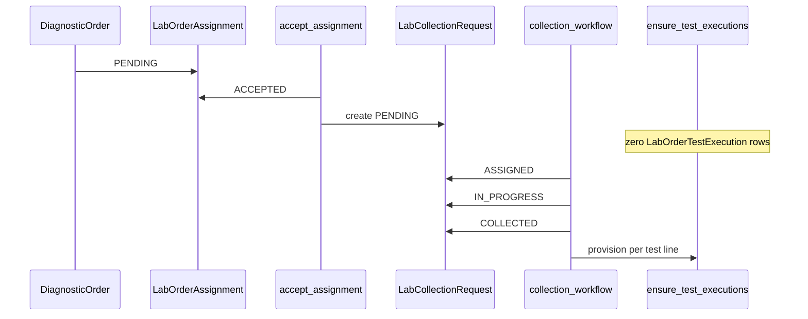
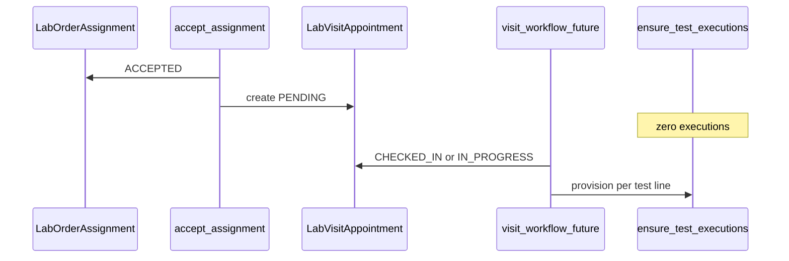

# Home Order Acceptance Workflow (Phase 1)

Related docs:

- [HOME_COLLECTION_PROVISIONING_ARCHITECTURE.md](./HOME_COLLECTION_PROVISIONING_ARCHITECTURE.md) — collection request provisioning
- [TEST_EXECUTION_PROVISIONING_ARCHITECTURE.md](./TEST_EXECUTION_PROVISIONING_ARCHITECTURE.md) — per-test execution provisioning

Implementation entry point: `labs/services/workflow_transitions.py` → `accept_assignment()`.

---

## What ACCEPT means

**Lab order assignment ACCEPT does not mean:**

- Sample was collected
- Patient arrived at the branch
- Tests are processing
- Reports are ready

**ACCEPT only means:**

> The lab agrees to handle this diagnostic order.

Execution and logistics workflows start **after** accept, on their own timelines.

---

## Three layers (ownership, logistics, execution)

| Layer | Model | Question it answers | Status after ACCEPT (typical) |
|-------|--------|---------------------|-------------------------------|
| Ownership | `LabOrderAssignment` | Which lab owns the order? | `ACCEPTED` |
| Logistics (home) | `LabCollectionRequest` | How is the sample collected at home? | `PENDING` |
| Logistics (visit) | `LabVisitAppointment` | When does the patient visit the branch? | `PENDING` |
| Execution | `LabOrderTestExecution` | What is each test's medical lifecycle? | **None yet** |

```text
DiagnosticOrder
      |
      v
LabOrderAssignment (lab accepted order)
      |
      +-------------------+
      |                   |
      v                   v
LabCollectionRequest   LabVisitAppointment   (home OR visit, not both)
      |
      v
LabOrderTestExecution (one row per test line — after logistics milestone)
```

**Why `LabCollectionRequest` / `LabVisitAppointment` stay `PENDING` after accept**

The logistics row is **created** on accept but **not completed**. `PENDING` means “awaiting phlebotomist / awaiting patient check-in,” not “lab has not accepted.” Assignment status (`ACCEPTED`) carries ownership; collection/visit status carries field operations.

---

## HOME workflow lifecycle



### Step-by-step

| Step | Service / API | Result |
|------|----------------|--------|
| 1 | `accept_assignment()` | `LabOrderAssignment` → `ACCEPTED` |
| 2 | `ensure_lab_collection_request(assignment)` | `LabCollectionRequest` → `PENDING` |
| 3 | Assign phlebotomist | `ASSIGNED` |
| 4 | Start collection | `IN_PROGRESS` |
| 5 | `mark_collected()` | `COLLECTED` |
| 6 | `ensure_test_executions(collection_request=...)` | one `LabOrderTestExecution` per `DiagnosticOrderTestLine` |

### HOME example: CBC + HbA1c + Lipid Panel

One `DiagnosticOrder` with three test lines:

1. **Accept** → 1 assignment (`ACCEPTED`), 1 collection request (`PENDING`), **0** executions.
2. **Collect** (after phlebo workflow) → 3 execution rows (`pending`, `execution_source: home_collection`).

---

## VISIT workflow lifecycle (Phase 1)



| Step | Phase 1 | Result |
|------|---------|--------|
| Accept | `accept_assignment()` | `LabVisitAppointment` `PENDING` via `get_or_create` |
| Check-in | Visit workflow API (future) | Call `ensure_test_executions(visit_appointment=...)` |
| Complete visit | Future | Does **not** provision executions |

Executions are provisioned at **CHECKED_IN** or **IN_PROGRESS**, not at **COMPLETED**.

---

## When execution rows are created

| Flow | Trigger | Must not provision on |
|------|---------|------------------------|
| Home | `CollectionStatus.COLLECTED` (`mark_collected`) | ACCEPT, routing, order create |
| Visit | `CHECKED_IN` or `IN_PROGRESS` (future hook) | ACCEPT, COMPLETED |

Safeguard in `ensure_test_executions()`:

- `assignment.status` must be `LabAssignmentStatus.ACCEPTED`
- Exactly one of `collection_request` or `visit_appointment` (XOR)

Execution row metadata (Phase 1):

```json
{
  "execution_source": "home_collection",
  "provisioned_at": "2026-05-17T12:00:00+00:00"
}
```

(`branch_visit` when linked via visit appointment.)

---

## Why collection is order-level

One home visit can collect samples for **all** tests on the order (CBC, HbA1c, Lipid) in a single trip. Logistics (phlebotomist, address, slot, collect/fail/retry) is shared.

`LabCollectionRequest` is intentionally **OneToOne** with `DiagnosticOrder`.

---

## Why execution is test-level

Each `DiagnosticOrderTestLine` can independently:

- Complete, fail, or need recollection
- Generate its own report (future)
- Route to a different lab (future multi-lab)

`LabOrderTestExecution` uses `ForeignKey(test_line)`, not `OneToOne`, to allow historical retries/recollections.

---

## Transaction safety on accept

`accept_assignment()` uses:

- `transaction.atomic()`
- `select_for_update()` on the assignment row
- Idempotent `ensure_lab_collection_request()` / `get_or_create` for visit

Safe under duplicate accept requests and concurrent calls.

---

## Future-proofing

| Capability | How architecture supports it |
|------------|------------------------------|
| Recollection | New execution row when prior row is terminal; partial unique on active statuses |
| Collection retry | `LabCollectionRequest` FAILED → PENDING without touching executions |
| Partial completion | Per-test execution status independent |
| Partial reports | Reports attach per test line / execution (future) |
| Multi-lab | Per-test execution routing without splitting `DiagnosticOrder` |
| Visit provisioning service | Planned: `labs/services/visit_appointment_provisioning.py` |

---

## Anti-patterns (do not do this)

### WRONG: ACCEPT → create executions

```text
accept_assignment() → ensure_test_executions()   # WRONG
```

**Why:** Creates orphan rows when collection fails, patient no-shows, or phlebotomist never assigned. Report and processing workflows see tests that were never collected.

### CORRECT: COLLECTED → create executions

```text
mark_collected() → ensure_test_executions(collection_request=...)   # CORRECT
```

Executions exist only when home sample collection actually succeeded.

### WRONG: Collection request owns report lifecycle

Reports and processing state belong on **`LabOrderTestExecution`** (and future report models per test line), not on `LabCollectionRequest` or `LabOrderAssignment`.

### CORRECT: LabOrderTestExecution owns execution lifecycle

```text
LabOrderAssignment     → ownership only
LabCollectionRequest   → logistics only
LabOrderTestExecution  → per-test medical execution
```

### WRONG: Expect visit/collection status ACCEPTED after lab accept

UI should show:

- Assignment: **Accepted by lab**
- Collection / visit: **Pending** (operations not started)

---

## Expected state summary

| Event | `LabOrderAssignment` | Logistics | `LabOrderTestExecution` count |
|-------|----------------------|-----------|-------------------------------|
| HOME accept | ACCEPTED | `LabCollectionRequest` PENDING | 0 |
| HOME collected | ACCEPTED | COLLECTED | N = test lines |
| VISIT accept | ACCEPTED | `LabVisitAppointment` PENDING | 0 |
| VISIT check-in (future) | ACCEPTED | CHECKED_IN / IN_PROGRESS | N = test lines |
