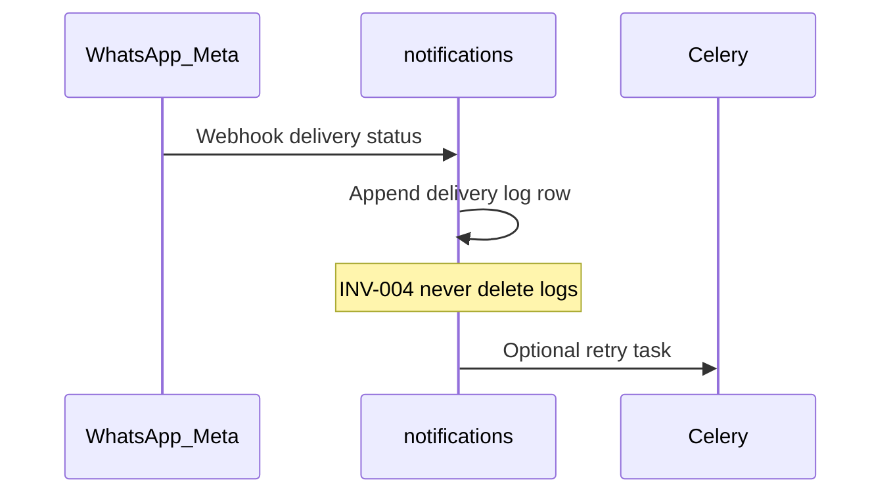

# Workflows — notifications

## WhatsApp prescription delivery

Cross-ref: [consultations_core/docs/WORKFLOWS.md](../../consultations_core/docs/WORKFLOWS.md)

## WhatsApp report delivery

Cross-ref: [diagnostics_engine/docs/WORKFLOWS.md](../../diagnostics_engine/docs/WORKFLOWS.md)

## Delivery callback

## Config

[CONFIGURATION.md](../../shared_docs/CONFIGURATION.md), [integrations/whatsapp-meta.md](../../shared_docs/integrations/whatsapp-meta.md)

Base API: `/api/notifications/`, `/api/v1/notifications/`
