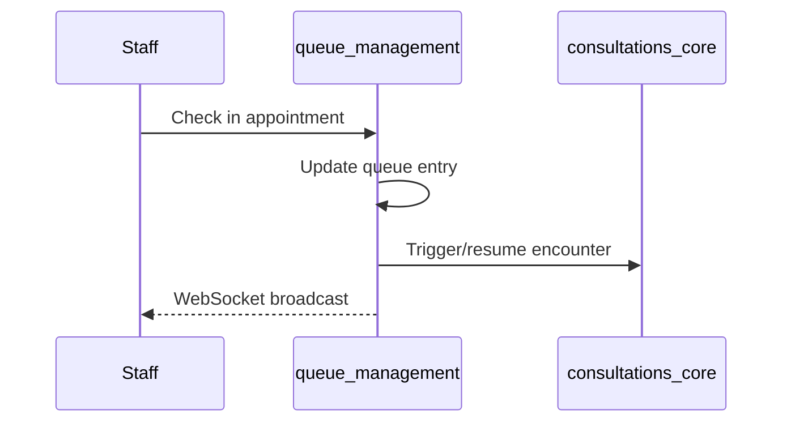

# Workflows — queue_management

Real-time patient queue via Django Channels (WebSocket).

## Check-in flow

Base API: `/api/queue/`

## Events

Publishes check-in consumed by consultations_core — [event_registry.md](../../shared_docs/event_registry.md).

## Integration

Syncs with doctor OPD status and appointment status.
