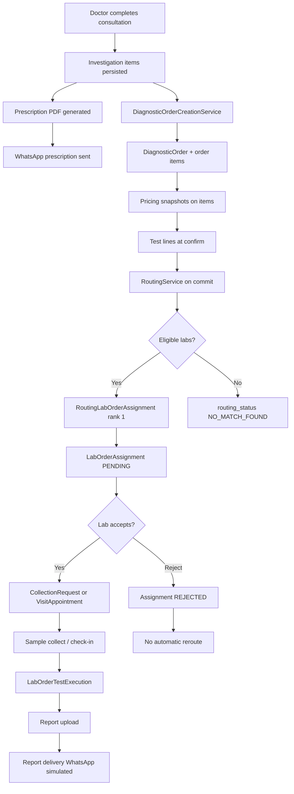

# 02 — End-to-End Workflow

## Purpose

Document the **as-is** diagnostics workflow from consultation through report delivery as implemented in the DoctorProCare codebase today.

**Target workflow** (recommendation before booking) is defined in [doctor_pro_2.0.md](doctor_pro_2.0.md) — not repeated here.

---

## Scope

- Current happy path and failure paths in production code
- Module boundaries at each step
- Out of scope: future WhatsApp booking flow, rerouting (see gap analysis)

---

## Current As-Is Workflow

---

## Step-by-Step (Current Implementation)

### 1. Consultation and investigations

| Step | Module | Key artifact |
|---|---|---|
| Doctor adds tests/packages | `consultations_core` | `InvestigationItem` under `ConsultationInvestigations` |
| Package snapshot at add time | `consultations_core` | `package_expansion_snapshot` JSON on item |
| End consultation | `consultations_core` | Bulk persist via `end_consultation_service` |

**API:** `POST /api/consultations/<id>/investigations/items/`

### 2. Prescription and WhatsApp (parallel to booking)

| Step | Module | Key artifact |
|---|---|---|
| Summary build | `consultations_core` | `PrescriptionSummaryBuilder` |
| PDF generate | `consultations_core` | `prescription_pdf_service` |
| Celery enqueue | `notifications` | `prepare_consultation_whatsapp` task |
| Meta send | `notifications` | `WhatsAppService` → `MetaWhatsAppClient` |
| Audit | `notifications` | `WhatsAppMessage` row |

Triggered from `consultations_core/api/views/preconsultation.py` on consultation finalize (`transaction.on_commit`).

See [10_WhatsApp_Integration.md](10_WhatsApp_Integration.md).

### 3. Diagnostic order creation (booking)

| Step | Module | Key artifact |
|---|---|---|
| Convert investigations | `diagnostics_engine` | `DiagnosticOrderCreationService.create_order_from_consultation()` |
| Filter sources | Same | Catalog + package only; custom rejected |
| Price quote | Same + `labs` pricing | `PricingQuoteService` per line |
| Collection mode | Same | `sample_collection_mode` = home if any line home-eligible |
| Idempotency | Same | Returns existing order for same consultation+encounter |

**API:** `POST /api/diagnostics/orders/create-from-consultation/`

Also invoked from end-consultation when actor has orchestration permission.

See [04_Booking_Lifecycle.md](04_Booking_Lifecycle.md).

### 4. Order confirm and test line expansion

| Step | Module | Key artifact |
|---|---|---|
| Status → CONFIRMED | `diagnostics_engine` | Order state machine |
| Package expand | `diagnostics_engine` | `expand_confirmed_order_packages()` |
| Single test lines | Same | `ensure_test_lines_for_test_items()` |
| Output | Same | `DiagnosticOrderTestLine` per service × qty |

### 5. Routing (post-order)

| Step | Module | Key artifact |
|---|---|---|
| Schedule | `diagnostics_engine` | `schedule_routing_after_commit()` |
| Eligibility | Same | `EligibilityEngine.evaluate_all()` |
| Ranking | Same | `RankingEngine.rank()` |
| Persist | Same | Snapshots + `RoutingLabOrderAssignment` |
| Provision lab queue | `labs` | `ensure_lab_order_assignment()` → `PENDING` |

See [05_Routing_and_Rerouting.md](05_Routing_and_Rerouting.md).

### 6. Laboratory operations

| Step | Module | Key artifact |
|---|---|---|
| Lab accepts | `labs` | `accept_assignment()` → ACCEPTED |
| Home path | `labs` | `LabCollectionRequest` provisioned |
| Lab visit path | `labs` | `LabVisitAppointment` provisioned |
| Auto-reject SLA | `labs` | `reject_stale_pending_assignments()` (60 min default) |
| Collect / check-in | `labs` | `LabOrderTestExecution` created |

See [06_Operations_Runbook.md](06_Operations_Runbook.md).

### 7. Report delivery

| Step | Module | Key artifact |
|---|---|---|
| Report upload | `diagnostics_engine` / `labs` | Report APIs |
| WhatsApp send | `diagnostics_engine` | `report_delivery_service` + `SimulatedWhatsAppProvider` |
| Celery | `diagnostics_engine` | `deliver_report_whatsapp` task |

Report WhatsApp does **not** use `notifications.WhatsAppService` or Meta production client today.

---

## Current vs Target (Summary Only)

| Stage | Target (doctor_pro_2.0) | Current |
|---|---|---|
| Pre-booking recommendation | Required | Missing |
| Patient confirms before order | Required | Order created at consultation end |
| Single lab fulfilment | Required | Implemented via routing rank #1 |
| Auto reroute (max 2) | Required | Not implemented |
| Patient price freeze at confirm | Required | Snapshots at order item creation; no separate quote lock |
| Routing audit | Required | First attempt fully audited |

Detail: [M1_Marketplace_Gap_Analysis.md](M1_Marketplace_Gap_Analysis.md).

---

## Actor Views

| Actor | Current touchpoints |
|---|---|
| Doctor | EMR consultation, investigation CRUD, end consultation |
| Patient | WhatsApp prescription (tests listed in template); no booking WhatsApp |
| Lab admin | Accept/reject, collection, visit, report upload |
| Platform | Routing runs, auto-reject cron, Celery workers |

---

## Marketplace Impact

The largest workflow divergence is **order creation before patient recommendation**. All downstream routing and lab ops assume an order already exists.

---

## Milestone 2

Insert read-only recommendation between investigation load and order creation. Does not change steps 6–7 initially.

---

## Reusable Components

| Component | Path |
|---|---|
| `DiagnosticOrderCreationService` | `diagnostics_engine/domain/order_creation.py` |
| `RoutingService.start_routing_for_order` | `diagnostics_engine/services/routing/routing_service.py` |
| `accept_assignment` | `labs/services/workflow_transitions.py` |
| `PrescriptionSummaryBuilder` | `consultations_core/services/prescription_summary_builder.py` |
| `prepare_consultation_whatsapp` | `notifications/tasks.py` |

---

## Known Gaps

- No pre-booking recommendation step
- No patient booking confirmation gate
- No automatic reroute on lab reject/timeout
- Report WhatsApp not on production Meta path
- `ROUTING_FAILED` patient notification not implemented

---

## Reference

**[M1_Marketplace_Gap_Analysis.md](M1_Marketplace_Gap_Analysis.md)** · [M1_Current_Feature_Matrix.md](M1_Current_Feature_Matrix.md)

Related: [04_Booking_Lifecycle.md](04_Booking_Lifecycle.md) · [05_Routing_and_Rerouting.md](05_Routing_and_Rerouting.md) · [10_WhatsApp_Integration.md](10_WhatsApp_Integration.md)
