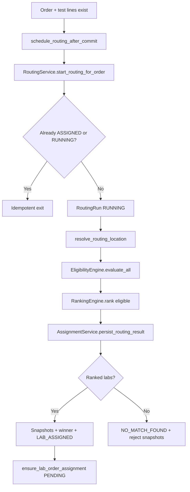

# 05 — Routing and Re-routing

## Purpose

Document the diagnostic routing engine as implemented: eligibility, ranking, assignment, snapshots, events, and scoring.

Re-routing (second attempt on reject/timeout) is **not implemented** — documented as a known gap only.

---

## Scope

- `RoutingService`, `EligibilityEngine`, `RankingEngine`, `AssignmentService`
- Routing models and audit chain
- Out of scope: reroute implementation (Milestone 6)

---

## Routing Pipeline

**Trigger:** `DiagnosticOrderCreationService` → `schedule_routing_after_commit()` via `transaction.on_commit`.

**Execution:** Synchronous in requesting process post-commit — no Celery worker for routing.

---

## Core Services

| Class | File | Role |
|---|---|---|
| `RoutingService` | `routing_service.py` | Orchestrator |
| `EligibilityEngine` | `eligibility_engine.py` | Pure filter — no writes |
| `RankingEngine` | `ranking_engine.py` | Hybrid scoring + sort |
| `AssignmentService` | `assignment_service.py` | Transactional persistence |
| `ScoringFunctions` | `scoring_functions.py` | Min-max normalization |
| `ScoringWeights` | `scoring_weights.py` | Injectable weights |

Public exports: `diagnostics_engine/services/routing/__init__.py`

---

## Eligibility Rules (Per Branch)

Evaluates all branches from `routable_lab_branches_queryset()`:

| Check | Ineligibility code |
|---|---|
| Branch inactive / deleted | `branch_inactive` |
| Org not orderable | `org_not_orderable` |
| Home mode, no home collection | `home_collection_not_supported` |
| Lab mode, no walk-in | `walk_in_not_supported` |
| Outside `BranchServiceArea` | `outside_service_area` |
| Missing service pricing | `missing_test_pricing` |
| Beyond home radius | `beyond_home_collection_radius` |

**Service area default:** branches with zero area records → allowed (`no_service_area_records_default_allow`).

**Location:** India-focused pincode resolution; haversine when lat/lon available.

**Hypothetical API:** `evaluate_requirements(service_ids, location, mode)` — no order required.

---

## Scoring

### Weights (default)

| Dimension | Weight |
|---|---|
| distance | 0.35 |
| price | 0.35 |
| tat | 0.25 |
| quality | 0.025 |
| partner | 0.025 |

Override: `DIAGNOSTICS_ROUTING_SCORING_WEIGHTS` in settings.

### Normalization

- Distance, price, TAT: min-max across pool; lower raw → higher score
- Missing values → score 0.0
- Quality, partner: flat **0.5** unless explicitly injected

### Labels (post-rank)

`CHEAPEST`, `FASTEST`, `NEAREST`, `RECOMMENDED`, `BEST_VALUE`

Stored on `RoutingDecisionSnapshot` with `decision_reason="hybrid_scoring_v1"`.

---

## Assignment Outcomes

### Success (ranked non-empty)

1. `EligibleLabSnapshot` per ranked branch (`ranking_position` 1..N)
2. `RoutingDecisionSnapshot` per eligible snapshot
3. `RoutingLabOrderAssignment` for rank #1 (`assignment_type=AUTO`)
4. Update `DiagnosticOrder.branch_id`, `routing_status=ASSIGNED`
5. `ensure_lab_order_assignment()` → `LabOrderAssignment` status `PENDING`
6. Events: `LAB_SUGGESTED`, `ASSIGNMENT_CREATED`, `ROUTING_COMPLETED`

### No match

1. Up to `DIAGNOSTIC_ROUTING_MAX_REJECT_SNAPSHOTS` (default 50) ineligible snapshots
2. `routing_status=NO_MATCH_FOUND`
3. Events: `NO_ELIGIBLE_LABS`, `ROUTING_COMPLETED`
4. Rejection histogram in run metadata

---

## Routing Models

**File:** `diagnostics_engine/models/routing.py`

| Model | Purpose |
|---|---|
| `RoutingRun` | One execution; `retry_count`, `last_retry_at` fields exist |
| `EligibleLabSnapshot` | Per-branch audit row |
| `RoutingDecisionSnapshot` | Scores + labels |
| `RoutingLabOrderAssignment` | Routing-layer winner |
| `RoutingEvent` | Append-only event log |

**Read API:** `GET /api/diagnostics/orders/<uuid>/routing/`

---

## Re-routing (Current State)

**Not implemented.**

| Target behavior (Marketplace spec) | Current |
|---|---|
| Max 2 routing attempts | Single attempt only |
| Exclude rejected branch on retry | No retry |
| Timeout → auto-reject → reroute | Auto-reject sets assignment REJECTED; no reroute |
| `ROUTING_FAILED` order status | Not emitted |
| `LAB_REJECTED`, `REASSIGNED` events | Defined in enum; not emitted from lab workflow |

**Existing partial support:**

- `reject_stale_pending_assignments()` — SLA auto-reject on `LabOrderAssignment`
- `RoutingRun.retry_count` field — unused
- `AssignmentType.PATIENT_SELECTED` / `HELPDESK_SELECTED` — enum only; routing always `AUTO`

---

## Idempotency Guards

- Skip if order already `ASSIGNED` with assignment
- Skip if another `RoutingRun` is `RUNNING`
- Failed runs do not auto-retry

---

## Debug and Observability

| Flag / tool | Purpose |
|---|---|
| `DIAGNOSTIC_ROUTING_JOURNEY_LOG` | Verbose journey logging |
| `DIAGNOSTIC_ROUTING_REJECT_DEBUG` | Rejection debug |
| `DIAGNOSTIC_ROUTING_PRICING_DEBUG` | Pricing filter ladder |
| `debug_lab_routing` command | Scenario debugger |
| `inspect_diagnostic_routing_order` | Order inspection |

---

## Limitations Summary

1. Quality/partner scores are placeholders
2. `RoutingStrategy` enum unused — always hybrid weighted
3. Synchronous post-commit execution
4. Distance often null (pincode-only) → distance dimension scores 0
5. Strict service UUID pricing — no fuzzy match
6. Auto-assign rank #1 only
7. Doctor-selected branch may differ from routing winner
8. No reroute loop

---

## Marketplace Impact

First-attempt routing and audit are production-grade. Phase 1 rerouting requirement (max 2 attempts) is entirely missing.

---

## Milestone 2

Read-only recommendation reuses `EligibilityEngine` + `RankingEngine` without `AssignmentService` persistence.

---

## Reusable Components

| Component | Path |
|---|---|
| `RoutingService.start_routing_for_order` | `routing_service.py` |
| `EligibilityEngine.evaluate_all` | `eligibility_engine.py` |
| `EligibilityEngine.evaluate_requirements` | Same |
| `RankingEngine.rank` | `ranking_engine.py` |
| `AssignmentService.persist_routing_result` | `assignment_service.py` |
| `schedule_routing_after_commit` | `routing_helpers.py` |
| `routable_lab_branches_queryset` | `routing_helpers.py` |

---

## Known Gaps

| Gap | Milestone |
|---|---|
| Pre-order recommendation | M2–M3 |
| Automatic reroute on reject | M6 |
| Automatic reroute on timeout | M6 |
| Branch exclusion list per order | M6 |
| `ROUTING_FAILED` + patient notify | M6 |
| Async routing worker | M8 (optional) |
| Real quality/partner data | Future |

---

## Reference

**[M1_Marketplace_Gap_Analysis.md](M1_Marketplace_Gap_Analysis.md)**

Tests: `diagnostics_engine/tests/test_routing_service.py`, `test_routing_e2e.py`

Related: [03_Recommendation_Engine.md](03_Recommendation_Engine.md) · [06_Operations_Runbook.md](06_Operations_Runbook.md)
