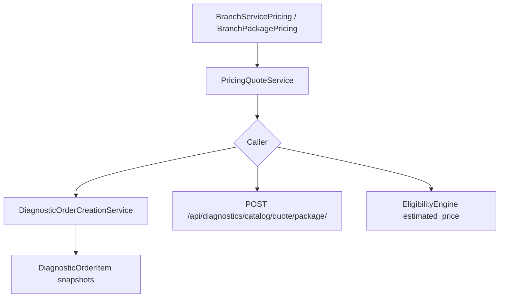

# 07 — Commercial and Pricing

## Purpose

Document every pricing-related component in the current codebase: ownership, quote flow, snapshots, imports, margins, and known limitations.

**This document describes current state only.** No pricing redesign.

---

## Scope

- `BranchServicePricing`, `BranchPackagePricing`
- `PricingQuoteService`
- XLSX import/export
- Order line snapshots
- Out of scope: settlement, price guarantee persistence (not implemented)

---

## Price Ownership

| Concern | Owner | Location |
|---|---|---|
| Pricing models | `labs` | `labs/models/branch_pricing.py` |
| Quote logic | `diagnostics_engine` | `diagnostics_engine/domain/pricing.py` |
| Order snapshots | `diagnostics_engine` | `DiagnosticOrderItem` fields |
| Routing price estimate | `diagnostics_engine` | `EligibilityEngine` sums `selling_price` |
| Branch catalog read APIs | `labs` | `labs/api/views/pricing_catalog.py` |

Models migrated from `diagnostics_engine` → `labs` (ADR documented in module docs).

---

## Pricing Models

### BranchServicePricing

Per `(LabBranch, DiagnosticServiceMaster)`:

- `selling_price`, `cost_price`
- Margin snapshots: `platform_margin_snapshot`, `doctor_margin_snapshot`, `lab_payout_snapshot`
- Config: `platform_margin_type/value`, `doctor_commission_type/value` (`CommissionType`: flat/percent)
- Operational: `report_delivery_hours`, `home_collection_supported`, `is_active`, `is_available`, validity window

Constraint: one active row per (branch, service).

### BranchPackagePricing

Per `(LabBranch, DiagnosticPackage)`:

- `mrp`, `selling_price`
- Commission fields + `lab_payout_snapshot`, `commission_source`, `settlement_cycle`
- `fulfillment_mode` (default `STRICT`)
- `home_collection_supported`

Constraint: one active row per (branch, package).

---

## PricingQuoteService

**File:** `diagnostics_engine/domain/pricing.py`

### `quote_service_line(branch, service)`

1. Resolve active `BranchServicePricing` (available, valid date window)
2. Return `selling_price`, margin snapshots (prefer snapshot fields, fallback to config values)
3. Raises if no pricing found

### `quote_package_line(branch, package)`

1. Look up active `BranchPackagePricing` → SKU price, `is_price_derived=False`
2. Else if `settings.DIAGNOSTICS_ALLOW_DERIVED_PACKAGE_PRICING=True` → sum service prices × qty; `is_price_derived=True`
3. Else → `ValueError` (derived disabled by default)

**Setting:** `DIAGNOSTICS_ALLOW_DERIVED_PACKAGE_PRICING = False` in `main/settings.py`

**ADR-002:** Package price is a marketing SKU, not sum-of-tests.

---

## Quote Flow Diagram

---

## Order Snapshots (Commercial Record at Booking)

Written in `DiagnosticOrderCreationService._create_order_items`:

| Field | Meaning |
|---|---|
| `price_snapshot` | Patient-facing line price |
| `platform_earning_snapshot` | Platform margin amount |
| `doctor_earning_snapshot` | Doctor commission amount |
| `lab_payout_snapshot` | Lab payout amount |
| `is_price_derived` | Package derived from service sum |
| `composition_snapshot` | Package service breakdown |
| `package_version_snapshot` | Package version at booking |

Order totals: `_calculate_totals()` → `total_amount_snapshot`, `final_amount` on `DiagnosticOrder`.

**Invariant INV-006:** Price snapshotted at booking.

**Without branch at booking:** all prices `0.00`; `metadata_snapshot.pricing_pending_branch = True`.

---

## XLSX Import / Export

### Template generation

- `diagnostics_engine/services/pricing_templates/generator.py`
- CLI: `python manage.py generate_lab_pricing_template --branch-code=...`
- Output: `MEDIA_ROOT/lab_pricing_templates/LabPricing_{branch}_v1.xlsx`

### Import

- `diagnostics_engine/services/pricing_templates/importer.py` → `import_lab_pricing()`
- CLI: `python manage.py sync_lab_pricing --file=... [--dry-run] [--strict]`
- **Scope: service pricing only** — no package sheet

**Phase 1 import margins:** doctor=0; platform=selling−cost; lab=cost.

**Limitations:**

- Rows with `is_available=FALSE` skipped
- No bulk deactivation of removed SKUs
- No package pricing import path

Ops guide: `labs/management/commands/lab_pricing_manual.md`

---

## Package Pricing Creation Paths (Today)

1. Django admin (`BranchPackagePricingAdmin`)
2. Seed command (`seed_investigation_diagnostics_data`)
3. Tests / manual creates

No REST write or XLSX import for packages.

---

## Margin and Commission

| Mechanism | Current behavior |
|---|---|
| `CommissionType.PERCENT` | Defined in choices; **not applied** in quote math |
| Display margin in catalog API | Service rows show margin; package rows hide margin (Phase 1 deferral) |
| `PackageQuoteView` response | Price + `is_price_derived` only — no margin fields |
| Routing price score | Sum of `BranchServicePricing.selling_price` across required services |

---

## STRICT Fulfillment (Pricing Gate)

**ADR-003:** `FulfillmentValidationService` requires active package pricing + every package service has branch service pricing.

Used at quote/confirm — not relaxed for partial fulfillment.

---

## Labs Pricing Read APIs

| Endpoint | Purpose |
|---|---|
| `GET .../pricing/summary/` | KPI aggregates |
| `GET .../pricing/services/` | Service catalog with filters |
| `GET .../pricing/packages/` | Package catalog |

Permission: `IsLabAdminUser`; branch scoped.

---

## Marketplace Impact

Pricing engine is production-ready for branch-anchored quotes. Gaps: pre-order total quotation API, patient quote lock separate from order snapshots, package XLSX import, percent commission math.

---

## Milestone 2

`PricingQuoteService` must be callable from read-only recommendation to produce authoritative total price per ranked branch.

---

## Reusable Components

| Component | Path |
|---|---|
| `PricingQuoteService.quote_service_line` | `diagnostics_engine/domain/pricing.py` |
| `PricingQuoteService.quote_package_line` | Same |
| `import_lab_pricing` | `diagnostics_engine/services/pricing_templates/importer.py` |
| `resolve_platform_margin` | `labs/api/services/pricing_catalog_presenter.py` |
| `PackageQuoteView` | `diagnostics_engine/api/views/catalog.py` |

---

## Known Gaps

| Gap | Detail |
|---|---|
| Derived package pricing | Off by default |
| Package import | No XLSX path |
| PERCENT commission | Not computed at quote time |
| Pre-booking quote API | Only package quote endpoint exists; no full-order quote |
| Patient price guarantee entity | Snapshots on order only — no separate quote lock |
| Reroute commercial delta | No internal absorption tracking |
| Settlement | Schema fields exist; no settlement engine |

---

## Reference

**[M1_Marketplace_Gap_Analysis.md](M1_Marketplace_Gap_Analysis.md)**

ADRs: [diagnostics_engine/docs/DECISIONS.md](../../../diagnostics_engine/docs/DECISIONS.md) · [diagnostics_engine/docs/VALIDATIONS.md](../../../diagnostics_engine/docs/VALIDATIONS.md)
