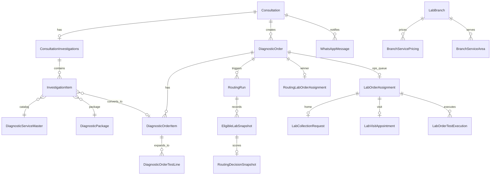

# 08 — Data Model and Audit

## Purpose

Document the cross-app entity map, relationships, and audit chains as implemented today across `consultations_core`, `diagnostics_engine`, `labs`, and `notifications`.

---

## Scope

- Primary models and FK relationships
- Audit and event tables
- Immutable history patterns
- Out of scope: proposed new models (see gap analysis)

---

## Cross-App Entity Map



---

## Layer Ownership

| Entity | Owner app | Table / model | Mutable by consumers? |
|---|---|---|---|
| `ConsultationInvestigations` | consultations_core | Container for investigation items | No |
| `InvestigationItem` | consultations_core | Clinical test/package lines | No |
| `CustomInvestigation` | consultations_core | Doctor-defined test master | No |
| `DiagnosticServiceMaster` | diagnostics_engine | Catalog service | Read-only from labs |
| `DiagnosticPackage` | diagnostics_engine | Catalog package | Read-only from labs |
| `DiagnosticOrder` | diagnostics_engine | Commercial booking | labs read FK |
| `DiagnosticOrderItem` | diagnostics_engine | Order line + price snapshots | No |
| `DiagnosticOrderTestLine` | diagnostics_engine | Expanded executable tests | labs read FK |
| `BranchServicePricing` | labs | Branch service price | diagnostics_engine reads |
| `BranchPackagePricing` | labs | Branch package price | diagnostics_engine reads |
| `RoutingRun` | diagnostics_engine | Routing attempt record | Append-only |
| `RoutingEvent` | diagnostics_engine | Routing audit events | Append-only |
| `LabOrderAssignment` | labs | Operational lab queue | diagnostics_engine provisions |
| `WhatsAppMessage` | notifications | Delivery audit | Append-only status updates |

Source: [shared_docs/ownership.md](../../ownership.md)

---

## Clinical Layer

**File:** `consultations_core/models/investigation.py`

| Model | Key fields | Notes |
|---|---|---|
| `ConsultationInvestigations` | `OneToOne` → `Consultation` | No class named `InvestigationContainer` |
| `InvestigationItem` | `source` (catalog/custom/package), FKs, `package_expansion_snapshot`, `diagnostic_order_item` | Soft delete via `is_deleted` |
| `CustomInvestigation` | Clinic-scoped master | Not convertible to lab order |

Constraints: exactly-one-path validation; unique active position per consultation.

---

## Commerce Layer

**File:** `diagnostics_engine/models/orders.py`

| Model | Key fields | Audit relevance |
|---|---|---|
| `DiagnosticOrder` | `sample_collection_mode`, `routing_status`, `branch_id`, `total_amount_snapshot` | Order-level commercial snapshot |
| `DiagnosticOrderItem` | `price_snapshot`, `platform_earning_snapshot`, `doctor_earning_snapshot`, `lab_payout_snapshot`, `composition_snapshot`, `is_home_collection_eligible` | INV-006 price frozen at booking |
| `DiagnosticOrderTestLine` | `service_id`, `execution_type` (HOME_COLLECTION / BRANCH_VISIT) | Routing eligibility input |

---

## Routing Audit Chain

**File:** `diagnostics_engine/models/routing.py`

```
DiagnosticOrder
  → RoutingRun (status, engine_version, location, metadata)
  → EligibleLabSnapshot (eligible ranked OR ineligible reject sample)
  → RoutingDecisionSnapshot (5 dimension scores, recommendation_labels)
  → RoutingLabOrderAssignment (single winner, assignment_type=AUTO)
  → RoutingEvent (ROUTING_STARTED, LAB_SUGGESTED, ASSIGNMENT_CREATED, etc.)
```

**Event types defined:** `RoutingEventType` in `diagnostics_engine/choices/routing.py`

**Emitted today:** `ROUTING_STARTED`, `ROUTING_COMPLETED`, `ROUTING_FAILED`, `NO_ELIGIBLE_LABS`, `LAB_SUGGESTED`, `ASSIGNMENT_CREATED`

**Defined but not emitted:** `LAB_ACCEPTED`, `LAB_REJECTED`, `AUTO_EXPIRED`, `REASSIGNED`, `COMPLETED`

**Read API:** `GET /api/diagnostics/orders/<uuid>/routing/` → `DiagnosticOrderRoutingSummaryView`

---

## Fulfilment Layer

**File:** `labs/models/lab_workflow.py`

| Model | Purpose |
|---|---|
| `LabOrderAssignment` | One-to-one with `DiagnosticOrder`; ops status PENDING→ACCEPTED/REJECTED |
| `LabCollectionRequest` | Home collection logistics |
| `LabVisitAppointment` | Branch visit logistics |
| `LabOrderTestExecution` | Per-test execution state |

**Dual assignment pattern:**

- `RoutingLabOrderAssignment` (diagnostics_engine) — marketplace routing winner + audit
- `LabOrderAssignment` (labs) — lab dashboard queue

Linked via `ensure_lab_order_assignment()` after routing persists.

---

## Pricing Layer

**File:** `labs/models/branch_pricing.py`

| Model | Purpose |
|---|---|
| `BranchServicePricing` | Per (branch, service): selling_price, cost_price, margin snapshots, home_collection_supported |
| `BranchPackagePricing` | Per (branch, package): mrp, selling_price, fulfillment_mode |
| `BranchServiceArea` | Pincode/city service area + home availability flag |

Migrated from diagnostics_engine to labs (migration `labs/migrations/0003_...`).

---

## Notification Audit

**File:** `notifications/models/whatsapp_notifications.py`

| Model | Purpose |
|---|---|
| `WhatsAppMessage` | Append-only delivery log; types include PRESCRIPTION, REPORT, TEST_BOOKING (stub) |

Status lifecycle: QUEUED → SENT → DELIVERED / FAILED / SKIPPED

Clinical audit also written via `prescription_whatsapp_audit.py` → `ClinicalAuditLog`.

---

## Status Registries

Cross-module status enums documented in [shared_docs/status_registry.md](../../status_registry.md).

Key enums:

- Order routing: `DiagnosticOrder.routing_status`
- Lab assignment: `labs/choices/workflow.py`
- Routing run: `diagnostics_engine/choices/routing.py`

---

## Invariants (Database-Backed)

| ID | Rule | Location |
|---|---|---|
| INV-002 | Booking has ≥1 test | Order validation |
| INV-006 | Package price snapshotted at booking | `DiagnosticOrderItem` |
| INV-004 | WhatsApp delivery append-only | `WhatsAppMessage` |

See [shared_docs/INVARIANTS.md](../../INVARIANTS.md).

---

## Marketplace Impact

Audit models for first routing attempt are production-grade. Missing: recommendation session entity, reroute attempt chain, commercial quote lock entity, unified event registry for marketplace patient notifications.

---

## Milestone 2

No new persistent models required for read-only recommendation. Optional recommendation cache/session deferred to gap analysis.

---

## Reusable Components

| Query / accessor | Path |
|---|---|
| Order + test lines for routing | `DiagnosticOrder.objects` + `test_lines` relation |
| Routing summary for order | `diagnostics_engine/api/views/order_routing.py` |
| Lab assignment by order | `LabOrderAssignment.objects.get(diagnostic_order=...)` |
| WhatsApp status by consultation | `notifications/api/views/status.py` |
| Branch pricing lookup | `BranchServicePricing` active window query (see `PricingQuoteService`) |

---

## Known Gaps

| Gap | Detail |
|---|---|
| No `RecommendationSession` or quote entity | Pre-booking recommendation has no persistence model |
| Reroute attempt numbering | `RoutingRun.retry_count` exists; reroute not implemented |
| Lab reject not in routing events | `LAB_REJECTED` defined, not emitted from lab workflow |
| Report delivery separate from `WhatsAppMessage` | Uses `LabReportDeliveryLog` + simulated provider |
| Marketplace status enum | Target statuses in Marketplace spec not mapped 1:1 to current fields |

---

## Reference

**[M1_Marketplace_Gap_Analysis.md](M1_Marketplace_Gap_Analysis.md)** · [M1_Current_Feature_Matrix.md](M1_Current_Feature_Matrix.md)

Module docs: [diagnostics_engine/docs/MODELS.md](../../../diagnostics_engine/docs/MODELS.md) · [labs/docs/MODELS.md](../../../labs/docs/MODELS.md)
