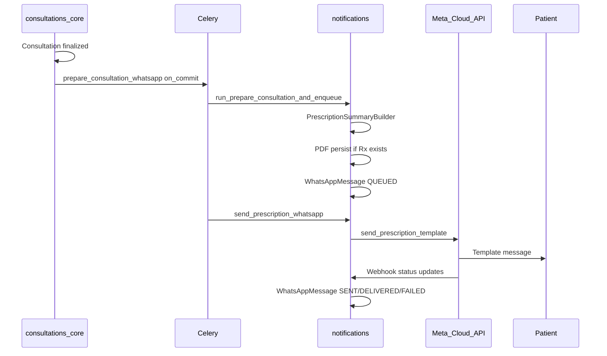

# 10 — WhatsApp Integration

## Purpose

Document the **current** WhatsApp integration as implemented. This module is one of the strongest in the platform.

**Phase 1 marketplace must extend this pipeline — never redesign it.**

---

## Scope

- Prescription / consultation summary delivery (production Meta path)
- Message builders, Celery, templates, token management
- Report delivery path (separate, simulated)
- Out of scope: Milestone 4 booking templates and conversation flow (see gap analysis)

---

## Current Production Flow (Prescription)

---

## Trigger Points

| Trigger | Location | Condition |
|---|---|---|
| Consultation finalize | `consultations_core/api/views/preconsultation.py` | `PRESCRIPTION_WHATSAPP_ASYNC=true` |
| Lazy enqueue | `GET .../whatsapp/status/consultation/<id>/?enqueue=true` | `notifications/api/views/status.py` |

Both use `transaction.on_commit` before Celery enqueue.

---

## Celery Tasks

**File:** `notifications/tasks.py`

| Task | Role |
|---|---|
| `prepare_consultation_whatsapp` | PDF → prepare message → chain send |
| `prepare_prescription_whatsapp` | Back-compat wrapper from prescription ID |
| `send_prescription_whatsapp` | Calls `WhatsAppService.send_prescription_message` (max 3 retries) |

---

## Orchestration Layer

| Component | File | Role |
|---|---|---|
| `prescription_whatsapp_orchestrator` | `notifications/services/delivery/prescription_whatsapp_orchestrator.py` | Load consultation, generate PDF, prepare delivery |
| `WhatsAppService` | `notifications/services/delivery/whatsapp_service.py` | Idempotency, phone validation, QUEUED/SKIPPED/FAILED lifecycle, retry/resend |
| `MetaWhatsAppClient` | `notifications/services/delivery/meta_client.py` | Graph API template send, parameter sanitization |

---

## Content Assembly (Channel-Agnostic → WhatsApp)

### PrescriptionSummaryBuilder

**File:** `consultations_core/services/prescription_summary_builder.py`

Builds:

- `patient_name`, `doctor_name`
- `medicine_summary` (truncated to `WHATSAPP_SUMMARY_MAX_MEDICINES`)
- `test_summary` (truncated to `WHATSAPP_SUMMARY_MAX_TESTS`)

Tests sourced from `consultation.investigations.items` — **this is how test recommendations appear in WhatsApp today** (embedded in prescription, not a separate message type).

Supports tests-only consultations (no prescription record).

### WhatsApp Template Renderer

**File:** `notifications/services/delivery/whatsapp_template_renderer.py`

| Function | Role |
|---|---|
| `render_prescription_whatsapp_body()` | Human-readable body (audit/debug) |
| `build_template_components()` | Meta template variables |
| `format_whatsapp_medicine_block()` | Medicine block formatting |
| `format_whatsapp_test_block()` | Test block formatting |

---

## Template Configuration

**Settings** (`main/settings.py`):

| Setting | Default |
|---|---|
| `WHATSAPP_PRESCRIPTION_TEMPLATE_NAME` | `consultant_utlity` |
| `WHATSAPP_TEMPLATE_BODY_PARAM_KEYS` | `patient_name,doctor_name,medicine_block,test_block` |
| `WHATSAPP_TEMPLATE_LANGUAGE_CODE` | `en` |
| `PRESCRIPTION_DOWNLOAD_BASE_URL` | PDF link base |

Integration docs: [shared_docs/integrations/whatsapp-meta.md](../../integrations/whatsapp-meta.md)

---

## Token and Credential Management

**Static env vars — no OAuth refresh:**

- `WHATSAPP_ACCESS_TOKEN`
- `WHATSAPP_PHONE_NUMBER_ID`
- `WHATSAPP_BUSINESS_ID`
- `WHATSAPP_WEBHOOK_VERIFY_TOKEN`

**DEBUG reload:** `meta_client._reload_whatsapp_env()` re-reads `.env` so Celery workers pick up token changes without restart.

**Simulated mode:** `WHATSAPP_USE_SIMULATED_PROVIDER=true` or missing token → fake `sim-wa-*` IDs, no HTTP.

---

## Audit Model

**Model:** `WhatsAppMessage` — `notifications/models/whatsapp_notifications.py`

| Field area | Purpose |
|---|---|
| `message_type` | PRESCRIPTION, REPORT, TEST_BOOKING, etc. |
| Status lifecycle | QUEUED → SENT → DELIVERED / FAILED / SKIPPED |
| Provider metadata | Meta message ID, webhook payloads |
| Soft delete audit | `deleted_by` — append-only delivery policy (INV-004) |

**Clinical audit:** `prescription_whatsapp_audit.py` → `ClinicalAuditLog`

---

## Webhook and Ops APIs

**Mount:** `/api/v1/notifications/` via `notifications/api/delivery_urls.py`

| Endpoint | Purpose |
|---|---|
| `whatsapp/webhook/` | Meta status callbacks |
| `whatsapp/status/consultation/<uuid>/` | Delivery status |
| `whatsapp/retry/<uuid>/` | Retry failed send |
| `whatsapp/resend/<prescription_id>/` | Resend prescription |
| `whatsapp/resend/consultation/<uuid>/` | Resend by consultation |

**Presentation:** `notifications/services/presentation/whatsapp_status.py`

---

## Phone Normalization

**File:** `notifications/services/delivery/phone_utils.py`

- E.164 normalization (+91 default for India)
- Patient phone resolution from consultation/profile

---

## Report WhatsApp (Separate Path — Not Production Meta)

| Component | File |
|---|---|
| Delivery service | `diagnostics_engine/services/reports/report_delivery_service.py` |
| Provider | `SimulatedWhatsAppProvider` in `delivery_providers.py` |
| API | `diagnostics_engine/api/views/reports/send_whatsapp.py` |
| Celery | `deliver_report_whatsapp` in `diagnostics_engine/tasks.py` |

**Gaps vs prescription path:**

- Does not create `WhatsAppMessage` rows
- Does not call `MetaWhatsAppClient`
- Simulated delivery only

---

## Message Types on Model (Schema vs Implementation)

| Type | Implemented? |
|---|---|
| `PRESCRIPTION` | Yes — full pipeline |
| `REPORT` | Partial — simulated in diagnostics_engine |
| `TEST_BOOKING` | **Schema only** — no sender/orchestrator |
| `APPOINTMENT`, `OTP`, `FOLLOWUP` | Schema only |

---

## Placeholder / Stub Files

These exist but are not production implementations:

- `notifications/api/views/notifications.py`
- `notifications/signals.py`
- `notifications/models/preferences.py`
- `consultations_core/models/recommendations.py` (empty)

---

## Marketplace Impact

WhatsApp prescription pipeline is production-ready and must be the foundation for Milestone 4. Test list already flows through `PrescriptionSummaryBuilder.test_summary`. Marketplace adds new templates and conversation steps — not a new delivery stack.

---

## Milestone 2

No WhatsApp changes for read-only recommendation engine.

---

## Reusable Components (Do Not Rebuild)

| Component | Path | Reuse for marketplace |
|---|---|---|
| `PrescriptionSummaryBuilder` | `consultations_core/services/prescription_summary_builder.py` | Test list content |
| `WhatsAppService` | `notifications/services/delivery/whatsapp_service.py` | Extend for TEST_BOOKING type |
| `MetaWhatsAppClient` | `notifications/services/delivery/meta_client.py` | New template methods |
| `whatsapp_template_renderer` | `notifications/services/delivery/whatsapp_template_renderer.py` | New template variables |
| `phone_utils` | `notifications/services/delivery/phone_utils.py` | Patient phone for booking |
| `whatsapp_status` serializers | `notifications/services/presentation/whatsapp_status.py` | UI/API status |
| Celery task pattern | `notifications/tasks.py` | on_commit → prepare → send chain |
| Webhook handler | `notifications/api/views/webhook.py` | Status tracking |

---

## Known Gaps

| Gap | Detail |
|---|---|
| TEST_BOOKING orchestrator | Model type exists; no implementation |
| Lab recommendation template | Not created |
| Interactive buttons / conversation | Not implemented |
| Report WhatsApp on Meta | Simulated only |
| Booking confirmation message | Not implemented |
| Routing failure patient notification | Not implemented |
| Token rotation | Manual env update only |

---

## Reference

**[M1_Marketplace_Gap_Analysis.md](M1_Marketplace_Gap_Analysis.md)** · [11_Channel_Architecture.md](11_Channel_Architecture.md)

Module docs: [notifications/docs/BUSINESS_FLOW.md](../../../notifications/docs/BUSINESS_FLOW.md) · [shared_docs/architecture/notifications.md](../notifications.md)

Related: [02_End_to_End_Workflow.md](02_End_to_End_Workflow.md) · [04_Booking_Lifecycle.md](04_Booking_Lifecycle.md)
