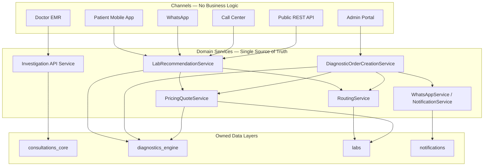

# 11 — Channel Architecture

## Purpose

Define the **golden architecture** for how all patient and operator channels must interact with marketplace domain services.

**Rule:** No channel may implement routing, pricing, or booking business logic independently.

This document is normative for Phase 1+ implementation. Milestone 1 analysis docs describe current state; this doc defines the target layering that prevents duplication.

---

## Scope

- Channel inventory
- Domain service layer
- Dependency rules
- Current vs target alignment

---

## Golden Architecture Diagram



---

## Channel Inventory

| Channel | Current use | Phase 1 target |
|---|---|---|
| Doctor EMR | Investigation CRUD, end consultation | Unchanged — clinical only |
| WhatsApp | Prescription delivery | + Recommendation + booking conversation |
| REST API | Order create, routing read, catalog | + Recommendation API |
| Admin Portal | Lab ops, pricing catalog | + Manual escalation (future) |
| Patient App | Not in scope M1 | Same domain services as WhatsApp |
| Call Center | Not in scope M1 | Same domain services as API |

---

## Domain Services (Mandatory Reuse)

| Service | Owner module | Responsibility | Channels must call |
|---|---|---|---|
| **Investigation API** | consultations_core | Clinical test/package lines | EMR only |
| **LabRecommendationService** | diagnostics_engine *(M2)* | Pre-booking lab rank + quote DTO | WhatsApp, App, API, Call Center |
| **PricingQuoteService** | diagnostics_engine | Branch line pricing | Via Recommendation + Booking only |
| **DiagnosticOrderCreationService** | diagnostics_engine | Persist booking after patient confirm | WhatsApp, App, API, Admin |
| **RoutingService** | diagnostics_engine | Post-booking assignment + audit | Internal — triggered by booking |
| **WhatsAppService** | notifications | Template send + delivery audit | WhatsApp channel only |
| **Lab workflow services** | labs | Accept/reject/collection/visit | Lab portal only |

---

## Dependency Rules

### Rule 1 — Channels are thin adapters

Channels may:

- Collect user input (location, confirmation, address, slot preference)
- Render responses (price, lab name, collection mode, buttons)
- Handle transport (HTTP, WhatsApp webhook, WebSocket)

Channels may **not**:

- Filter eligible laboratories
- Compute prices or margins
- Rank branches
- Create `DiagnosticOrder` without `DiagnosticOrderCreationService`
- Send WhatsApp without `WhatsAppService`

### Rule 2 — Recommendation before booking

```
Channel → LabRecommendationService.recommend(consultation, location, mode)
       → if success: show offer to patient
       → if patient confirms: DiagnosticOrderCreationService.create(...)
       → RoutingService triggered on commit (existing)
```

No channel skips the recommendation service in Phase 1.

### Rule 3 — Pricing single source

All displayed prices come from `PricingQuoteService` (or eligibility `estimated_price` for routing context — must reconcile with quote service in M2).

### Rule 4 — Routing single source

Post-booking assignment only via `RoutingService`. Reroute (M6) extends `RoutingService` — not channel logic.

### Rule 5 — Notification single source

Patient messages via `notifications.WhatsAppService` (prescription today; TEST_BOOKING in M4). Report delivery must migrate from simulated provider to same stack (M7).

---

## Current vs Target Alignment

| Layer | Current | Gap |
|---|---|---|
| WhatsApp → Prescription | Correct — uses `WhatsAppService` | Extend, don't replace |
| EMR → Order create | Bypasses recommendation | M5 adds confirm gate |
| API → Order create | Direct `create-from-consultation` | M3 adds recommend endpoint first |
| Report WhatsApp | Separate simulated path | M7 unify under notifications |
| Recommendation | Inside `RoutingService` post-order | M2 extract read-only service |

---

## WhatsApp Extension Pattern (Phase 1)

**Do not redesign.** Extend existing pipeline:

```
Existing: finalize → PrescriptionSummaryBuilder → WhatsAppService → Meta

New (M4):   recommendation DTO → new template → WhatsAppService → Meta
            patient reply webhook → booking adapter → DiagnosticOrderCreationService
```

Reuse: `phone_utils`, `whatsapp_template_renderer`, Celery task pattern, `WhatsAppMessage` audit.

Detail: [10_WhatsApp_Integration.md](10_WhatsApp_Integration.md)

---

## API Extension Pattern (Phase 1)

```
GET/POST /api/diagnostics/recommendations/   (M3 — thin adapter)
POST     /api/diagnostics/orders/create-from-consultation/  (existing — gated in M5)
GET      /api/diagnostics/orders/<id>/routing/  (existing — post-booking read)
```

---

## Marketplace Impact

This document is the guardrail for Milestones 2–8. Any implementation that duplicates eligibility, pricing, or ranking in a channel violates Phase 1 architecture.

---

## Milestone 2

Introduce `LabRecommendationService` as the first new domain service in this diagram. All channels depend on it for lab offers.

---

## Reusable Components

See per-module docs for implementation detail:

- [03_Recommendation_Engine.md](03_Recommendation_Engine.md)
- [04_Booking_Lifecycle.md](04_Booking_Lifecycle.md)
- [07_Commercial_and_Pricing.md](07_Commercial_and_Pricing.md)
- [05_Routing_and_Rerouting.md](05_Routing_and_Rerouting.md)
- [10_WhatsApp_Integration.md](10_WhatsApp_Integration.md)

---

## Known Gaps

| Gap | Milestone |
|---|---|
| `LabRecommendationService` does not exist | M2 |
| Channels can bypass recommendation today | M3–M5 |
| Report delivery not on notification stack | M7 |
| No call center / app adapters | Future |

---

## Reference

**[M1_Marketplace_Gap_Analysis.md](M1_Marketplace_Gap_Analysis.md)** · [M1_Current_Feature_Matrix.md](M1_Current_Feature_Matrix.md)

Requirements: [doctor_pro_2.0.md](doctor_pro_2.0.md)
