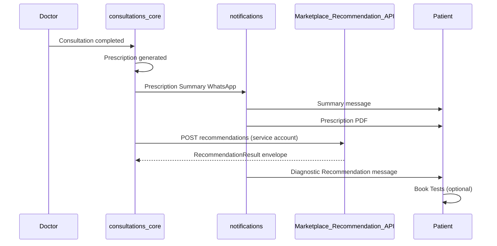
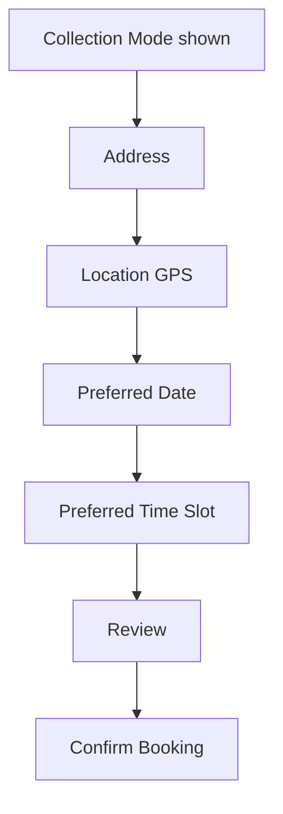
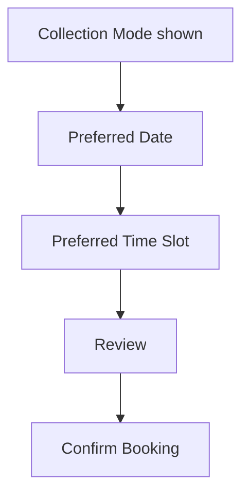
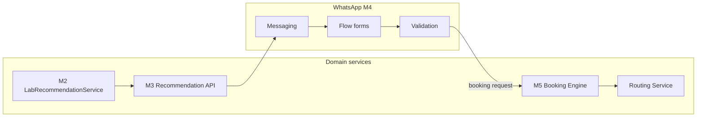

# 11 — WhatsApp Booking Flow

**DoctorProCare WhatsApp Booking Flow**

| | |
|---|---|
| **Document type** | Production architecture standard |
| **Version** | 1.0 |
| **Status** | Approved design (frozen before M4 implementation) |
| **Scope** | Milestone 4 — complete WhatsApp booking journey |
| **Canonical for** | WhatsApp, mobile app, web portal, call center (WhatsApp is first consumer) |

> Recommendation is ~10% of this workflow. This document covers the **full journey** from recommendation message through booking confirmation — not “recommendation flow” alone.

**Related architecture (do not duplicate here):**

| Topic | Document |
|-------|----------|
| Recommendation engine (domain) | [03_Recommendation_Engine.md](03_Recommendation_Engine.md) |
| Booking persistence & orders | [04_Booking_Lifecycle.md](04_Booking_Lifecycle.md) |
| Routing & assignment | [05_Routing_and_Rerouting.md](05_Routing_and_Rerouting.md) |
| Current WhatsApp prescription pipeline | [10_WhatsApp_Integration.md](10_WhatsApp_Integration.md) |
| Channel layering rules | [11_Channel_Architecture.md](11_Channel_Architecture.md) |
| Marketplace Recommendation API (M3) | [milestone_3/M3_API_Contract.md](milestone_3/M3_API_Contract.md) |
| Delivery plan | [Delivery_Roadmap.md](Delivery_Roadmap.md) |

---

## 1. Purpose

This document defines the **complete WhatsApp booking workflow** for diagnostic test booking.

It covers:

- Recommendation message
- Patient interaction
- WhatsApp booking form (Flow)
- Review and booking confirmation handoff
- Failure handling
- Future extensibility for mobile, web, and call center

It does **not** describe internal routing algorithms or booking persistence. Those remain in the documents listed above.

This is the **single source of truth** for WhatsApp-based diagnostic booking in DoctorProCare.

---

## 2. Business objective

The patient should book laboratory tests from WhatsApp in the fewest possible steps.

The platform must:

- Recommend the best laboratory (via M3 API — never in WhatsApp layer)
- Verify fulfilment before any patient-facing booking UI starts
- Avoid collecting unnecessary information
- Minimise patient effort

---

## 3. Entry point

The workflow begins **only after** the existing prescription WhatsApp pipeline completes.



**Ordered gates:**

1. Doctor completes consultation  
2. Prescription generated  
3. Prescription Summary WhatsApp sent  
4. Prescription PDF sent  
5. Laboratory Recommendation Engine executed (M2 via M3 API)  
6. Recommendation available (`recommendation.available = true`)  
7. Diagnostic Recommendation WhatsApp sent  

Steps 5–7 must **not** run if recommendation is unavailable (see §11).

---

## 4. Preconditions

### Start only when

- Consultation is completed
- Recommendation API returns `recommendation.available = true`
- At least one laboratory can fulfil the **complete** order (already enforced by M2/M3)

### Never start when

- `error.code = NO_ELIGIBLE_LABORATORY` (or any unavailable recommendation)
- Recommendation API unreachable / expired (`metadata.expires_at` passed)
- `recommendation_id` missing from successful response

Store `metadata.recommendation_id` and `metadata.expires_at` when sending the recommendation message. M4 confirm handoff must reference the same `recommendation_id` (M5 booking engine validates TTL).

---

## 5. Recommendation message

Patient receives a **single CTA** template.

### Content (logical fields)

| Template variable | Source |
|-------------------|--------|
| `{{patient_name}}` | Patient profile (notifications layer — not from Recommendation API) |
| `{{tests}}` | `tests[]` + `packages[]` from Recommendation API |
| `{{mrp}}` | Display MRP — see §13 (M4 may extend API or derive from catalog snapshot) |
| `{{price}}` | `recommendation.quoted_price` (DoctorPro Price) |
| `{{saving}}` | Display savings — `mrp - quoted_price` when MRP available |

### Message body (reference copy)

```
Doctor's Recommended Tests

Hello {{patient_name}}

Your doctor has recommended:

{{tests}}

MRP
₹{{mrp}}

DoctorPro Price
₹{{price}}

You Save
₹{{saving}}

Included
✓ Test Scheduling
✓ Pay After Service
✓ Digital Reports

Powered by DoctorProCare
```

### Button

| Button | Action |
|--------|--------|
| **Book Tests** | Opens WhatsApp Flow — **only** action |

No secondary CTAs in Phase 1.

---

## 6. Book Tests button

**Book Tests** opens the WhatsApp Flow (Meta Flow API).

On button tap:

| Action | Allowed? |
|--------|----------|
| Open WhatsApp Flow form | Yes |
| Create booking | **No** |
| Collect payment | **No** |
| Create appointment | **No** |
| Create DiagnosticOrder | **No** |

The button **only starts information collection**.

Pass into the Flow (hidden/context fields):

- `recommendation_id` (from `metadata.recommendation_id`)
- `consultation_id`
- `collection_mode` (from API — read-only in Flow)

---

## 7. Collection mode

Collection mode is **determined by the Recommendation Engine** (`recommendation.collection_mode`).

**Patients do not choose collection mode** in Phase 1.

| API value | Patient sees |
|-----------|--------------|
| `home` | Collection Mode — ✓ Home Collection |
| `lab` | Collection Mode — ✓ Visit Laboratory |

Use `recommendation.home_collection_available` / `lab_visit_available` for future multi-option UI — Phase 1 displays the engine decision only.

---

## 8. Home collection flow



| Step | Required data |
|------|----------------|
| Collection mode | Display only (from API) |
| Address | Patient text address |
| Location | GPS pin (WhatsApp location message or Flow location picker) |
| Preferred date | Patient selection |
| Preferred slot | Patient selection (`available_slot_dates` null in M3 — static slot list in M4 until slot API exists) |
| Review | See §10 |
| Confirm | Submit booking **request** to Booking Engine (M5) — not immediate order |

---

## 9. Laboratory visit flow



| Step | Required data |
|------|----------------|
| Collection mode | Display only — Visit Laboratory |
| Preferred date | Patient selection |
| Preferred slot | Patient selection |
| Review | See §10 |
| Confirm | Submit booking request (M5) |

**No address** is requested for lab visit.

Branch context for patient trust (display on review, from API):

- `recommendation.branch.name`
- `recommendation.branch_address`
- `recommendation.google_maps_url`
- `recommendation.branch_working_hours.display`

---

## 10. Review screen

Display before confirm:

| Field | Source |
|-------|--------|
| Recommended laboratory | `recommendation.lab.display_name` |
| Branch | `recommendation.branch.name` |
| Collection mode | `recommendation.collection_mode` |
| Tests | `tests[]` |
| Packages | `packages[]` |
| Amount | `recommendation.quoted_price` |
| Preferred date | Flow input |
| Preferred slot | Flow input |
| Address | Flow input (home collection only) |
| TAT (optional) | `recommendation.estimated_tat_hours` |

Patient taps **Confirm Booking**.

Confirm submits a **booking request payload** (M5) containing:

- `recommendation_id`
- `consultation_id`
- `client_request_id` (Flow session id for idempotency)
- collection mode, date, slot, address/location (home only)

No DiagnosticOrder is created inside WhatsApp (M4). Persistence is M5.

---

## 11. Failure flow

When Recommendation API returns unavailable (e.g. `error.code = NO_ELIGIBLE_LABORATORY`):

**Do not** send Book Tests template. Send unavailability message instead.

### Reference copy

```
Sorry.

We are currently unable to arrange your diagnostic tests in your area.

No booking has been created.
No payment has been collected.

Our team will continue expanding our laboratory network.

Thank you for choosing DoctorProCare.
```

Use `error.next_action` internally for ops/analytics (`CHANGE_LOCATION`, etc.) — not shown to patient in Phase 1.

Flow **ends**. No WhatsApp Flow opens.

---

## 12. Booking principles (M4 scope boundary)

The WhatsApp layer in Milestone 4 must **never**:

- Create booking immediately
- Collect payment
- Create appointment records in EMR
- Assign laboratory
- Create `DiagnosticOrder`
- Trigger routing

The WhatsApp layer in Milestone 4 **only**:

- Sends recommendation / failure messages
- Opens Flow for data collection
- Validates required fields
- Submits booking **request** to Booking Engine (M5 handoff contract TBD in M5 docs)

---

## 13. Data required from Recommendation API

WhatsApp consumes **only** the M3 Marketplace Recommendation API.

**Endpoint:** `POST /api/v1/marketplace/diagnostics/recommendations/`

Full schema: [milestone_3/M3_API_Contract.md](milestone_3/M3_API_Contract.md)

### Required fields for WhatsApp (M4)

| WhatsApp need | API field |
|---------------|-----------|
| Laboratory | `recommendation.lab` |
| Branch | `recommendation.branch` |
| DoctorPro Price | `recommendation.quoted_price` |
| MRP | `recommendation.mrp` *(M4 API extension — until added, omit MRP block or use catalog quote)* |
| Savings | Derived: `mrp - quoted_price` when MRP present |
| Collection mode | `recommendation.collection_mode` |
| Home collection flag | `recommendation.home_collection_available` |
| Branch address | `recommendation.branch_address` |
| Maps link | `recommendation.google_maps_url` |
| TAT | `recommendation.estimated_tat_hours` |
| Test list | `tests[]` |
| Package list | `packages[]` |
| Correlation | `metadata.recommendation_id`, `metadata.expires_at` |
| Failure UX | `error.code`, `error.next_action` |

The WhatsApp layer **never calculates pricing or routing**.

---

## 14. Channel responsibilities



| Layer | Responsibility |
|-------|----------------|
| Recommendation Engine (M2) | Laboratory selection, eligibility, ranking |
| Recommendation API (M3) | Transport, TTL, audit, channel-ready fields |
| WhatsApp (M4) | Messaging, Flow, validation, confirm handoff |
| Booking Engine (M5) | Persistence, order creation, routing trigger |

---

## 15. Future compatibility

Future versions may add without redesigning this workflow:

- Patient address validation (API-side)
- Live slot availability (`available_slot_dates` populated)
- Rescheduling and cancellation
- Payment collection
- Multi-lab booking
- AI conversation
- Multilingual templates
- Mobile / web using same Flow-equivalent screens fed by same M3 API

New capabilities extend API fields or M5 handoff — **not** WhatsApp-side business logic.

---

## 16. Production rules

The WhatsApp workflow must **never**:

- Recommend a laboratory
- Calculate prices
- Determine collection mode
- Perform routing
- Create `DiagnosticOrder`
- Assign laboratories

The WhatsApp workflow must **always**:

- Consume Recommendation API (M3)
- Display recommendation exactly as returned
- Collect only required information per collection mode
- Keep patient interaction minimal
- Hand off booking to Booking Engine (M5)
- Respect `metadata.expires_at` — re-fetch recommendation if expired before Flow confirm

---

## 17. Success criteria (M4 exit)

The Milestone 4 workflow is complete when:

- [ ] Prescription Summary is delivered (existing pipeline)
- [ ] Prescription PDF is delivered (existing pipeline)
- [ ] Recommendation message is delivered when `available = true`
- [ ] Unavailability message is delivered when `available = false`
- [ ] **Book Tests** opens WhatsApp Flow
- [ ] Collection mode is shown automatically (no patient selection)
- [ ] Home collection Flow collects address + location + date + slot
- [ ] Laboratory visit Flow collects date + slot only (no address)
- [ ] Review screen shows API-sourced lab, branch, tests, price
- [ ] Confirm submits booking request with `recommendation_id` (M5 integration or stub documented)
- [ ] No DiagnosticOrder / routing / payment in M4 code paths

---

## 18. Reference

→ [Delivery_Roadmap.md](Delivery_Roadmap.md) — Milestone 4  
→ [milestone_3/M3_API_Contract.md](milestone_3/M3_API_Contract.md)  
→ [11_Channel_Architecture.md](11_Channel_Architecture.md)  
→ [M1_Marketplace_Gap_Analysis.md](M1_Marketplace_Gap_Analysis.md) — remaining gaps (MRP field, slot API, M5 handoff)

**This document is the governing specification for all WhatsApp-based diagnostic booking flows in DoctorProCare.**
