# M1 — Marketplace Gap Analysis

## Purpose

**Single source for "what do we build next?"**

Every gap from Milestone 1 current-state analysis is centralized here with business impact, recommended milestone, dependencies, and priority.

Individual module docs ([01](01_Business_Principles.md)–[11](11_Channel_Architecture.md)) describe **what exists today** only. Future implementation detail lives **here** and in [Delivery_Roadmap.md](Delivery_Roadmap.md).

---

## How to Read This Document

```
Current State → Gap → Business Impact → Recommended Milestone → Dependencies → Priority
```

Quick status: [M1_Current_Feature_Matrix.md](M1_Current_Feature_Matrix.md)

Golden architecture: [11_Channel_Architecture.md](11_Channel_Architecture.md)

---

## Gap Register

### GAP-001 — Pre-booking laboratory recommendation

| Field | Value |
|---|---|
| **Current state** | `RoutingService` runs only after `DiagnosticOrder` + test lines exist. `EligibilityEngine.evaluate_requirements()` supports hypothetical orders but has no production service wrapper. |
| **Gap** | No read-only recommendation before booking. |
| **Business impact** | Violates Principle 3 and Requirement R1 (doctor_pro_2.0). Patients cannot see lab offer before order is created. Risk of unfulfillable bookings from patient perspective. |
| **Recommended milestone** | **M2** — `LabRecommendationService` |
| **Dependencies** | Package expansion reuse (GAP-002), pricing quote integration (existing) |
| **Priority** | P0 — blocks M3, M4, M5 |
| **Reuse** | `evaluate_requirements`, `RankingEngine.rank`, `PricingQuoteService`, `_normalize_package_composition` |
| **Exit criterion** | Same rank #1 as post-order routing for equivalent inputs |

---

### GAP-002 — Package expansion in recommendation path

| Field | Value |
|---|---|
| **Current state** | Expansion at prescription time (`build_package_expansion_snapshot`) and order confirm (`expand_confirmed_order_packages`). |
| **Gap** | No shared function called from pre-order recommendation to produce flat `service_id[]`. |
| **Business impact** | Package bookings may evaluate wrong service set if expansion logic duplicated or skipped. |
| **Recommended milestone** | **M2** (extract, don't rewrite) |
| **Dependencies** | None |
| **Priority** | P0 |
| **Reuse** | `_normalize_package_composition`, active service validation from `order_creation.py` |

---

### GAP-003 — Recommendation REST API

| Field | Value |
|---|---|
| **Current state** | `GET /api/diagnostics/orders/<id>/routing/` post-order only. Package quote endpoint exists in isolation. |
| **Gap** | No API: consultation + location → lab, branch, price, collection mode, distance, TAT, labels. |
| **Business impact** | WhatsApp, mobile app, call center cannot consume recommendation. |
| **Recommended milestone** | **M3** |
| **Dependencies** | GAP-001 (M2 service) |
| **Priority** | P0 |
| **Suggested contract** | Input: consultation_id, location (pincode/coords), optional collection_mode. Output per Delivery Roadmap M3. |

---

### GAP-004 — WhatsApp recommendation flow

| Field | Value |
|---|---|
| **Current state** | Prescription WhatsApp with `test_block` in template. `TEST_BOOKING` message type on model — no sender. |
| **Gap** | No lab recommendation template, interactive buttons, or conversation handler. |
| **Business impact** | Primary patient channel cannot start marketplace booking journey. |
| **Recommended milestone** | **M4** |
| **Dependencies** | GAP-003 (API or direct service call from Celery adapter) |
| **Priority** | P1 |
| **Constraint** | **Extend** existing `WhatsAppService` / Celery pattern — never redesign ([10_WhatsApp_Integration.md](10_WhatsApp_Integration.md)) |

---

### GAP-005 — Booking gated on patient confirmation

| Field | Value |
|---|---|
| **Current state** | `DiagnosticOrderCreationService` invoked at consultation end without patient confirm step. |
| **Gap** | Order created before patient accepts recommendation. |
| **Business impact** | Violates "recommendation before booking" and "booking after confirm" production rules. |
| **Recommended milestone** | **M5** |
| **Dependencies** | GAP-001, GAP-004 (or other channel confirm) |
| **Priority** | P0 |
| **Reuse** | Existing `DiagnosticOrderCreationService` — add gate, do not fork logic |

---

### GAP-006 — Address capture and slot preference

| Field | Value |
|---|---|
| **Current state** | Location resolved from patient/clinic/pincode at routing time. No booking-form capture. |
| **Gap** | No structured address or preferred slot collection in booking flow. |
| **Business impact** | Home collection cannot be scheduled accurately; distance scoring may use wrong coords. |
| **Recommended milestone** | **M5** |
| **Dependencies** | GAP-005 |
| **Priority** | P1 |

---

### GAP-007 — Automatic rerouting (max 2 attempts)

| Field | Value |
|---|---|
| **Current state** | Single routing run. Lab reject/auto-reject ends at `LabOrderAssignment.REJECTED`. `RoutingRun.retry_count` unused. |
| **Gap** | No second routing attempt excluding failed branch. No `ROUTING_FAILED` terminal state. |
| **Business impact** | Violates Requirement R4, Rules 3–4 (Marketplace spec). Manual ops burden on lab reject. |
| **Recommended milestone** | **M6** |
| **Dependencies** | GAP-005 (booking exists), branch exclusion list per order |
| **Priority** | P0 |
| **Design notes** | New `RoutingRun` per attempt; emit `LAB_REJECTED`, `REASSIGNED`; never re-include excluded branch |

---

### GAP-008 — Patient notification on routing failure

| Field | Value |
|---|---|
| **Current state** | No patient WhatsApp for routing failure or recommendation unavailable. |
| **Gap** | `ROUTING_FAILED` notify not implemented. |
| **Business impact** | Violates Requirement R6. Patient left without closure. |
| **Recommended milestone** | **M6** (failure path) + **M4** (recommendation unavailable) |
| **Dependencies** | GAP-004, GAP-007 |
| **Priority** | P1 |

---

### GAP-009 — Report WhatsApp on production Meta stack

| Field | Value |
|---|---|
| **Current state** | `SimulatedWhatsAppProvider` in diagnostics_engine; no `WhatsAppMessage` row. |
| **Gap** | Report delivery not on `MetaWhatsAppClient`. |
| **Business impact** | Milestone 7 exit criterion not met for real patients. |
| **Recommended milestone** | **M7** |
| **Dependencies** | Existing report upload flow |
| **Priority** | P1 |
| **Constraint** | Unify under `notifications.WhatsAppService` per [11_Channel_Architecture.md](11_Channel_Architecture.md) |

---

### GAP-010 — Patient price guarantee persistence

| Field | Value |
|---|---|
| **Current state** | `price_snapshot` on `DiagnosticOrderItem` at order creation. No separate quote lock from recommendation. |
| **Gap** | Recommended price at offer time not frozen separately; reroute commercial delta not tracked. |
| **Business impact** | Requirement R5 partially met at order level only; reroute margin absorption not auditable. |
| **Recommended milestone** | **Phase 3** (Commercial audit — post Phase 1 MVP) |
| **Dependencies** | GAP-001, GAP-005, GAP-007 |
| **Priority** | P2 |

---

### GAP-011 — Commercial settlement platform

| Field | Value |
|---|---|
| **Current state** | Margin/payout snapshot fields on pricing and order lines. `settlement_cycle` on package pricing — schema only. |
| **Gap** | No ledger, reconciliation, or lab payout runs. |
| **Business impact** | Manual commercial ops; out of Phase 1 scope per doctor_pro_2.0. |
| **Recommended milestone** | **Phase 5 / Future** |
| **Dependencies** | GAP-010 |
| **Priority** | P3 |

---

### GAP-012 — Quality and partner scoring from real data

| Field | Value |
|---|---|
| **Current state** | Flat 0.5 for quality and partner dimensions in `RankingEngine`. |
| **Gap** | No lab SLA history, ratings, or partner tier integration. |
| **Business impact** | "Best lab" is price/distance/TAT only; acceptable for Phase 1. |
| **Recommended milestone** | **Future** |
| **Dependencies** | Ops data collection |
| **Priority** | P3 |

---

### GAP-013 — Routing events for lab accept/reject

| Field | Value |
|---|---|
| **Current state** | `LAB_ACCEPTED`, `LAB_REJECTED` in `RoutingEventType` enum — not emitted from `labs` workflow. |
| **Gap** | Routing audit incomplete for ops lifecycle. |
| **Business impact** | Cannot fully answer "why rejected?" from routing event chain alone. |
| **Recommended milestone** | **M6** |
| **Dependencies** | GAP-007 |
| **Priority** | P1 |

---

### GAP-014 — Home collection per-service flag in routing eligibility

| Field | Value |
|---|---|
| **Current state** | Booking sets mode from pricing `home_collection_supported`. Routing checks branch/org/radius but not per-service home flag on pricing rows. |
| **Gap** | Potential mismatch between recommended mode and branch capability at service level. |
| **Business impact** | Edge-case unfulfillable home orders if branch supports home but not specific test. |
| **Recommended milestone** | **M2** (validate in recommendation) or **M8** hardening |
| **Dependencies** | GAP-001 |
| **Priority** | P2 |

---

### GAP-015 — Async routing / performance at scale

| Field | Value |
|---|---|
| **Current state** | Routing runs synchronously on `transaction.on_commit`. |
| **Gap** | Large branch pools block post-commit thread. |
| **Business impact** | Latency under load; not blocking Phase 1 functional MVP. |
| **Recommended milestone** | **M8** |
| **Dependencies** | None |
| **Priority** | P2 |

---

### GAP-016 — Package pricing XLSX import

| Field | Value |
|---|---|
| **Current state** | Service pricing import only via `sync_lab_pricing`. |
| **Gap** | Packages created via admin/seed only. |
| **Business impact** | Ops friction scaling lab onboarding; not blocking recommendation logic. |
| **Recommended milestone** | **Future** (ops tooling) |
| **Dependencies** | None |
| **Priority** | P3 |

---

### GAP-017 — Marketplace operational status enum

| Field | Value |
|---|---|
| **Current state** | Separate status fields on order, routing, assignment, collection. |
| **Gap** | Target statuses (RECOMMENDATION_PENDING, BOOKING_PENDING, etc.) from Marketplace spec not unified. |
| **Business impact** | Ops/dashboard complexity; mappable from existing fields for Phase 1. |
| **Recommended milestone** | **M8** (dashboard) or **Future** |
| **Dependencies** | GAP-001, GAP-005 |
| **Priority** | P2 |

---

## Milestone Dependency Graph

```mermaid
flowchart TD
    M1[M1 Analysis Complete] --> M2[M2 LabRecommendationService]
    M2 --> M3[M3 Recommendation API]
    M3 --> M4[M4 WhatsApp Recommendation]
    M2 --> M5[M5 Booking after Confirm]
    M4 --> M5
    M5 --> M6[M6 Rerouting max 2]
    M5 --> M7[M7 Report Delivery Meta]
    M6 --> M8[M8 Production Hardening]
    M7 --> M8
```



**Do not start M2 until M1 documents approved.**

---

## Priority Summary

| Priority | Gaps | Milestone |
|---|---|---|
| **P0** | GAP-001, 002, 003, 005, 007 | M2–M6 core path |
| **P1** | GAP-004, 006, 008, 009, 013 | M4–M7 patient experience |
| **P2** | GAP-010, 014, 015, 017 | Phase 3 / M8 |
| **P3** | GAP-011, 012, 016 | Future |

---

## Long-Term Platform Services (Target)

| Service | Status | Owner |
|---|---|---|
| Investigation API Service | ✅ Exists | consultations_core |
| PricingQuoteService | ✅ Exists | diagnostics_engine |
| LabRecommendationService | ❌ M2 | diagnostics_engine |
| DiagnosticOrderCreationService | ✅ Exists (needs gate M5) | diagnostics_engine |
| RoutingService (+ reroute M6) | ⚠️ Partial | diagnostics_engine |
| WhatsAppService | ✅ Exists (extend M4) | notifications |
| Lab workflow services | ✅ Exists | labs |

Channels map: [11_Channel_Architecture.md](11_Channel_Architecture.md)

---

## What NOT to Duplicate

| Logic | Single owner | Do not reimplement in |
|---|---|---|
| Eligibility filtering | `EligibilityEngine` | WhatsApp, API, admin |
| Lab ranking | `RankingEngine` | Any channel |
| Line pricing | `PricingQuoteService` | Recommendation UI |
| Order persistence | `DiagnosticOrderCreationService` | WhatsApp handler |
| Template send | `WhatsAppService` | diagnostics_engine reports |
| Lab accept/reject | `workflow_transitions` | diagnostics_engine |

---

## Approval Checklist (Milestone 1 Exit)

- [ ] All handbook docs 01–11 reviewed
- [ ] [M1_Current_Feature_Matrix.md](M1_Current_Feature_Matrix.md) approved
- [ ] This gap register approved
- [ ] Engineering sign-off: no M2 work until checklist complete
- [ ] Product sign-off: gaps mapped to Delivery Roadmap milestones

---

## Reference

Analysis docs: [00_README.md](00_README.md) · Requirements: [doctor_pro_2.0.md](doctor_pro_2.0.md) · [DoctorProCare Diagnostics Marketplace.md](DoctorProCare%20Diagnostics%20Marketplace.md) · Roadmap: [Deilvery_roadmap.md](Deilvery_roadmap.md)
