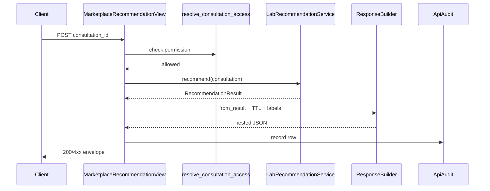
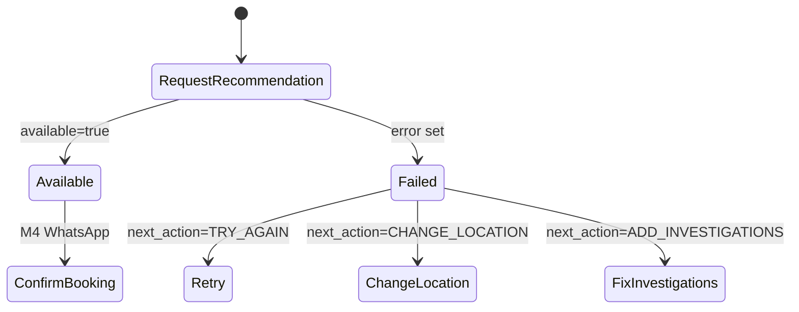

# M3 — API Architecture

## Layer diagram

```
Client (WhatsApp / Mobile / Doctor / Admin / Call Center)
    ↓ JWT
MarketplaceRecommendationView          ← transport only
    ↓
LabRecommendationService.recommend()     ← M2 domain (unchanged)
    ↓
investigation_resolution → EligibilityEngine → RankingEngine → PricingQuoteService
    ↓
MarketplaceRecommendationResponseBuilder ← enrichment (labels, branch, TTL)
    ↓
MarketplaceRecommendationApiAudit        ← audit insert (1 row/call)
```

## Principles

1. API never decides — only `LabRecommendationService`
2. API never calls `RoutingService` or creates `DiagnosticOrder`
3. Every response includes `recommendation_id` + TTL (no recommendation cache DB in M3)
4. Nested envelope: `metadata`, `recommendation`, `tests`, `packages`, `error`

## Namespace

```
POST /api/v1/marketplace/diagnostics/recommendations/
```

Future domains: `/api/v1/marketplace/{domain}/recommendations/`

## Sequence diagram



## Request lifecycle

1. Resolve `request_id` (header or generated)
2. Validate request body
3. Load consultation + access check
4. Call `LabRecommendationService.recommend()` (read-only business path)
5. Build envelope with metadata, enrichment, error mapping
6. Emit structured logs + metrics hook
7. Persist audit row
8. Return HTTP response

## State diagram (client)


