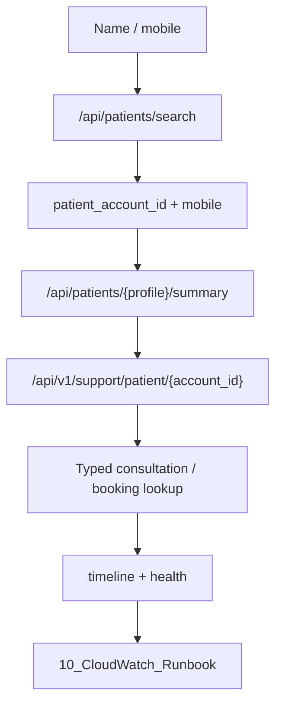

# 08 — Patient Journey Runbook

Master runbook: start from **name / mobile / doctor / date** and reconstruct the full clinical + operational chain. Use this first when the workflow is unclear.

Identifiers: [`_foundation/00_IDENTIFIERS.md`](_foundation/00_IDENTIFIERS.md) · Tables: [`_foundation/01_TABLE_MAP.md`](_foundation/01_TABLE_MAP.md)

---

## 0. Quick Triage

```text
Quick Triage
  Estimated Time: ~5 min
  Inputs Needed: □ Patient Name  □ Mobile  □ Doctor  □ Date  □ Clinic  □ Time
  First Action: Patient search by name/mobile → copy patient_account_id → GET /api/v1/support/patient/{id}?expand=timeline,summary,health
  Expected Output: □ Patient found  □ Consultation/Booking found  □ Correlation ID  □ Support Trace status
```

## 1. Purpose

Reconstruct any completed or in-flight patient journey for production support: consultation → prescription → diagnostic order (booking) → routing → report → WhatsApp delivery.

**Does not cover:** Doctor login / KYC / clinic inactive ([13_Admin_Operations_Runbook.md](13_Admin_Operations_Runbook.md)), platform-down emergencies ([12_Emergency_Runbook.md](12_Emergency_Runbook.md)).

## 2. Severity

| Level | When |
|-------|------|
| **P1** | Many patients cannot complete journeys; Support API / audit projection down |
| **P2** | Single patient missing consultation, booking, report, or WhatsApp |
| **P3** | Timeline incomplete but care completed successfully |
| **P4** | Label / display mismatch only |

## 3. User may say

- “Find everything for patient Rahul Sharma / this mobile.”
- “Did the doctor finish the consultation? Did report get sent?”
- “Patient booked tests but never got anything.”
- “Helpdesk paste: name + date — what happened?”

## 4. Information to collect

- Patient name and/or mobile
- Doctor name, clinic, approximate date/time
- Optional: visit_pnr, order_number, prescription_pnr, WhatsApp screenshot

## 5. Escalation

| If | Escalate to |
|----|-------------|
| Patient exists but no encounter/consultation for stated date | Developer (clinical path) |
| Order/booking missing after recommendation | Developer (diagnostics) |
| WhatsApp status failed / Meta errors | Infra |
| `support_trace` empty while audits exist | Backend (projection / Celery) |
| Logs missing in CloudWatch | DevOps — [10_CloudWatch_Runbook.md](10_CloudWatch_Runbook.md) |

## 6. Investigation flow

```text
Complaint (name/mobile/doctor/date)
  → GET /api/patients/search/?query=...   (or list/?q=...)
  → Save: patient_account_id, profile_id, mobile
  → GET /api/patients/{profile_id}/summary/
  → Save: consultation_id, prescription_id
  → GET /api/v1/support/patient/{patient_account_id}?expand=timeline,summary,health,relationships
  → If focused visit: GET /api/v1/support/consultation/{consultation_id}?expand=...
  → If diagnostics: resolve booking_id (= DiagnosticOrder UUID) → GET /api/v1/support/booking/{booking_id}
  → Optional shell: IncidentReconstructionService.reconstruct_booking(booking_id)
  → CloudWatch: See 10 — search correlation_id
```



## 7. Expected Database State

Healthy completed journey (rows exist in order):

```text
account_user (username = mobile)
  → patient_account_patientaccount
  → patient_account_patientprofile
  → consultations_core_clinicalencounter (visit_pnr)
  → consultations_core_consultation
  → (optional) consultations_core_prescription
  → (optional) diagnostics_engine_diagnosticorder  (= booking; UUID = booking_id)
  → (optional) diagnostics_engine_routingrun + routing assignment / lab_order_assignments
  → (optional) diagnostics_engine_diagnostictestreport + artifacts
  → (optional) whatsapp_messages
  → clinical_audit + business_audit (correlation_id)
  → support_trace (latest state indexed)
```

**Empty link in this chain = failure locus.** Jump to the matching playbook (01–07).

## 8. API flow (prefer Support APIs)

```text
GET /api/patients/search/?query={name}
GET /api/patients/list/?q={name}&filter=recent
GET /api/patients/{profile_id}/summary/
GET /api/v1/support/search?q={mobile|consultation_id|booking_id}&expand=timeline,summary,health,relationships
GET /api/v1/support/patient/{patient_account_id}?expand=timeline,summary,health,relationships
GET /api/v1/support/consultation/{consultation_id}?expand=...
GET /api/v1/support/booking/{booking_id}?expand=...
GET /api/v1/support/correlation/{correlation_id}/timeline
```

**Incident reconstruction — no REST:**

```python
from support_trace.incident import IncidentReconstructionService, ReconstructionLevel
report = IncidentReconstructionService.reconstruct_booking("<booking_id>", level=ReconstructionLevel.FULL)
```

## 9. Expected Audit / Trace / Logs

```text
Clinical Audit: consultation.started → vitals/symptoms/diagnosis → prescription.* → consultation.completed
                (+ test.ordered, report.* when diagnostics ran)
Business Audit: recommendation / booking / routing / report delivery transitions
Support Trace:  status Completed or Running; identifiers populated
CloudWatch:     See 10_CloudWatch_Runbook.md — filter by correlation_id
```

## 10. SQL (pointers)

See [`11_Common_SQL_Queries.md`](11_Common_SQL_Queries.md): **Patient**, **Support Trace**.

Critical start:

```sql
-- Latest support traces for a phone
SELECT workflow_instance_id, workflow_type, status, last_event, consultation_id, booking_id, correlation_id
FROM support_trace
WHERE phone_number = '<digits>'
ORDER BY last_event_at DESC
LIMIT 20;

-- Latest consultations by patient name (approx)
SELECT c.id AS consultation_id, e.visit_pnr, c.started_at, e.status
FROM consultations_core_consultation c
JOIN consultations_core_clinicalencounter e ON e.id = c.encounter_id
JOIN patient_account_patientprofile p ON p.id = e.patient_profile_id
WHERE p.first_name ILIKE '%Rahul%' AND p.last_name ILIKE '%Sharma%'
ORDER BY c.started_at DESC
LIMIT 10;
```

## 11. Common issues → possible reasons

| Symptom | Likely cause |
|---------|--------------|
| Name search empty | Wrong clinic workspace; inactive profile; spelling |
| Patient found, Support patient lookup empty | Journey never wrote audits / identifier sync failed |
| Summary has consultation; support_trace missing consultation_id | Projection lag / on_commit / Celery |
| Multiple traces for one patient | Expected — filter by date / consultation_id |
| Search by name on Support API fails | Unsupported — use Patient search first |

## 12. Resolution

1. Resolve IDs via Patient search (§8).
2. Open correct specialized runbook if chain is broken (01 consultation, 03 booking, 05–07 report/WA).
3. Confirm Care outcome for the patient (clinical + ops).
4. Confirm Support Trace / timeline matches DB chain.
5. Attach correlation_id + investigation_id to the ticket.

## 13. What Success Looks Like

```text
Success Criteria
  □ Patient identified (account + profile + mobile)
  □ Correct consultation / booking located for the stated date
  □ Timeline shows clinical + business events in order
  □ Support Trace status matches reality (Completed or Failed with known cause)
  □ Downstream specialist runbook completed if needed
  □ Ticket has correlation_id + key entity IDs
```

---

**Next hops:** [01 Consultation](01_Consultation_Runbook.md) · [03 Test Booking](03_Diagnostic_Test_Booking_Runbook.md) · [06 Report Delivery](06_Report_Delivery_Runbook.md) · [07 WhatsApp](07_WhatsApp_Delivery_Runbook.md)
