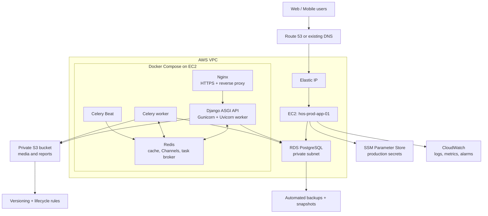
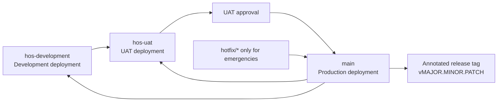
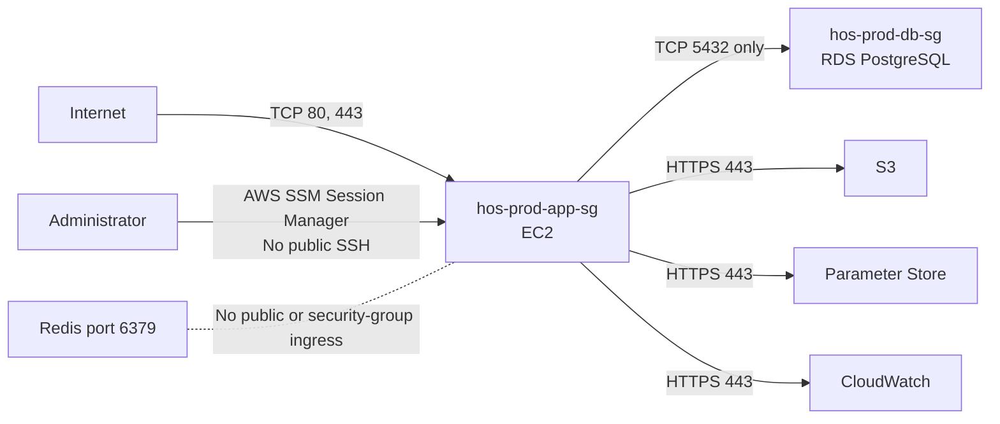

# HOS API — AWS Production Deployment Runbook

## 1. Purpose and scope

This is the production deployment runbook for the HOS Django backend. It defines the first AWS deployment architecture, the AWS resources, security boundaries, environment configuration, release process, validation, backup, and rollback steps.

This first release deliberately avoids application refactoring, Kubernetes, ECS, autoscaling, and load balancers. It deploys the existing backend safely using one application server and managed data services. Scale-out work comes only after UAT and production are stable.

## 2. Decisions for the first production release

| Area | Decision |
| --- | --- |
| Application runtime | One Amazon EC2 instance running Docker Compose. |
| API server | Gunicorn with Uvicorn worker behind Nginx. ASGI is required because the backend uses Django Channels. |
| Background work | Celery worker and Celery Beat containers on the same EC2 instance. |
| Cache and task broker | Redis container on the EC2 instance; no public Redis access. |
| Database | Amazon RDS for PostgreSQL, private and reachable only from the application EC2 security group. |
| Media and generated reports | Private Amazon S3 bucket. |
| HTTPS | Nginx plus Let's Encrypt/Certbot on EC2 for the first release. |
| DNS | Amazon Route 53 if the domain is managed in AWS; otherwise create the same DNS record at the existing provider. |
| Secrets | AWS Systems Manager Parameter Store SecureString values, read through a least-privilege EC2 IAM role. |
| Logs and alerts | Amazon CloudWatch Logs, metrics, and alarms. |
| Environments | `hos-development` → development, `hos-uat` → UAT, `main` → production. |

> Do not use the same database, S3 bucket, Redis instance, or secrets for UAT and production.

## 3. Target AWS architecture



## 4. Release and environment flow



Normal work is committed on `hos-development`. Promote the tested branch with a merge to `hos-uat`. Only merge UAT-approved code to `main`. Production deploys only from `main`, and every completed production deployment receives an annotated Git tag.

## 5. AWS resources to create

| Resource | Suggested name | Required configuration |
| --- | --- | --- |
| VPC | `hos-prod-vpc` | Use the default VPC only for the first launch if no separate VPC is available; otherwise use public and private subnets. |
| EC2 | `hos-prod-app-01` | Ubuntu LTS, EBS gp3 volume, Elastic IP, IAM instance role, Docker Engine, Docker Compose, CloudWatch agent, SSM agent. |
| Security group | `hos-prod-app-sg` | Permit HTTP 80 and HTTPS 443 from the internet; use Session Manager instead of opening SSH. |
| RDS PostgreSQL | `hos-prod-postgres` | Private/not publicly accessible, encryption at rest, automated backups, deletion protection, database security group only. |
| Security group | `hos-prod-db-sg` | Permit PostgreSQL 5432 only from `hos-prod-app-sg`. |
| S3 | `hos-prod-media-<account-id>` | Block all public access, encryption, versioning, lifecycle policy, narrowly scoped IAM access. |
| Parameter Store | `/hos/production/*` | SecureString parameters for all production secrets and configuration. |
| IAM role | `hos-prod-app-role` | Read only `/hos/production/*`; read/write only the production S3 bucket; CloudWatch logging permissions. |
| CloudWatch | `/hos/production/backend` | Log group, retention policy, alarms for EC2 and RDS. |
| Route 53 record | `api.<your-domain>` | A record to the EC2 Elastic IP, or equivalent record at another DNS provider. |

### Not part of the first release

- Application Load Balancer and AWS Certificate Manager
- ECS, EKS, Lambda, or Auto Scaling
- ElastiCache for Redis
- CloudFront
- Multi-region failover

These are future scale and availability improvements. Do not introduce them before the first UAT and production deployment works reliably.

## 6. Network and security rules



Required controls:

- RDS must be **not publicly accessible**.
- Redis must listen only within Docker/private localhost networking; never expose port `6379` to the internet.
- Do not open EC2 port `22` publicly. Use AWS Systems Manager Session Manager for server access.
- Permit only ports `80` and `443` publicly. Redirect HTTP to HTTPS after certificate validation.
- Encrypt the RDS instance, EBS volume, S3 bucket, and Parameter Store values.
- Give the EC2 IAM role only the required S3 bucket, Parameter Store path, and CloudWatch permissions.
- Keep Django `DEBUG=False`, explicit `ALLOWED_HOSTS`, explicit CORS origins, secure cookies, and SSL redirect enabled in production.
- Rotate all existing development/local credentials before production use. Never copy local `.env` values to production.

## 7. Backend readiness items before deployment

The current repository already has these settings modules:

```text
main.settings.development
main.settings.uat
main.settings.production
main.settings.test
```

Before deployment, complete only the following deployment items. Commands and file layout are in [docker-compose-runbook.md](docker-compose-runbook.md).

1. Pin Gunicorn and Uvicorn in `requirements/production.txt` and run Gunicorn with `uvicorn.workers.UvicornWorker`.
2. Add `Dockerfile`, shared `compose.yaml` plus environment overrides, Nginx configuration, and `scripts/deploy-*.sh`.
3. Add a non-sensitive `/health/` endpoint for load/startup validation.
4. Ensure the production URL configuration does not serve `MEDIA_URL` through Django; media must use S3 or protected application download endpoints.
5. Confirm the production settings module loads only `.env.production`/process values and refuses to start when secrets, hosts, or database values are missing.
6. Use `requirements/production.txt` for production installation, never development or test requirements.

No Django app reorganisation, model changes, API route changes, or database migration refactors are required for this deployment phase.

## 8. Production container layout

The production Docker Compose stack must contain these services:

| Container | Responsibility | Public port |
| --- | --- | --- |
| `nginx` | TLS termination, HTTP-to-HTTPS redirect, reverse proxy, static assets. | 80 and 443 |
| `api` | Django ASGI application process. | Internal only |
| `celery-worker` | Asynchronous jobs. | Internal only |
| `celery-beat` | Scheduled Celery jobs. | Internal only |
| `redis` | Cache, Channels, and Celery broker. | Internal only |

Use named volumes only for Nginx certificates and generated static files. Persist no database data on EC2. Store media in S3 and database data in RDS.

The API, worker, and beat containers must set:

```text
DJANGO_SETTINGS_MODULE=main.settings.production
```

The UAT stack uses:

```text
DJANGO_SETTINGS_MODULE=main.settings.uat
```

## 9. Environment variables and secret ownership

Store production values under a restricted SSM path such as `/hos/production/`. Render them into a root-readable server environment file during deployment, or inject them directly into the Compose process. Do not put values in GitHub, source code, Docker images, or committed `.env` files.

| Category | Required variables |
| --- | --- |
| Core Django | `SECRET_KEY`, `DEBUG=false`, `ALLOWED_HOSTS`, `DJANGO_TIME_ZONE`, `ENVIRONMENT=production` |
| Database | `DB_NAME`, `DB_USER`, `DB_PASSWORD`, `DB_HOST`, `DB_PORT=5432` |
| Redis/Celery | `REDIS_HOST`, `REDIS_PORT`, `REDIS_URL`, `CELERY_TASK_ALWAYS_EAGER=false` |
| Browser security | `CORS_ALLOWED_ORIGINS`, `CSRF_TRUSTED_ORIGINS`, `SECURE_SSL_REDIRECT=true`, `SECURE_HSTS_SECONDS` |
| AWS storage | `AWS_REPORTS_BUCKET`, `AWS_REGION`, `AWS_S3_REGION_NAME`, `REPORT_ARTIFACT_STORAGE=s3` |
| Integrations | Required WhatsApp/Meta credentials and webhook verification values |
| Operations | `LOG_LEVEL`, `SERVICE_NAME`, `APPLICATION_VERSION`, `CLOUDWATCH_LOG_GROUP`, `CLOUDWATCH_LOG_STREAM` |

Use [`.env.production.example`](../Hospital-Management-API/.env.production.example) only as the field list. It is not a production secret file.

## 10. AWS infrastructure setup sequence

### A. Account and region

1. Select one region close to users and keep EC2, RDS, S3, and CloudWatch in that region where possible.
2. Enable MFA for the AWS root account; do not use root credentials for deployment.
3. Create an administrator/deployment IAM identity and record account ownership.
4. Configure AWS billing alerts before creating resources.

### B. Networking

1. Create the VPC/subnets if not using the default VPC.
2. Create `hos-prod-app-sg`: allow inbound TCP 80 and 443 from the internet.
3. Create `hos-prod-db-sg`: allow inbound TCP 5432 from `hos-prod-app-sg` only.
4. Do not create public inbound rules for PostgreSQL, Redis, Celery, or the Django application port.

### C. Data services

1. Create the RDS PostgreSQL instance with private access, encryption, deletion protection, and automated backups.
2. Set a backup retention period appropriate to the business; start with at least seven days.
3. Create a manual RDS snapshot immediately before the first production migration and before every risky migration.
4. Create the private S3 media bucket; enable block public access, default encryption, versioning, and a lifecycle policy for old versions.
5. Create distinct UAT database and S3 resources.

### D. EC2 and operations

1. Launch the EC2 instance with an encrypted EBS volume, Elastic IP, `hos-prod-app-sg`, and `hos-prod-app-role`.
2. Install Docker Engine, Docker Compose, SSM Agent, and the unified CloudWatch agent.
3. Configure the CloudWatch agent to collect system metrics and container/application logs.
4. Configure Nginx and Certbot; validate HTTPS before enabling Django SSL redirect.
5. Configure CloudWatch alarms for EC2 status checks, disk use, CPU, RDS storage, and application errors.

Amazon RDS provides automated backups and point-in-time recovery within its configured retention period. [AWS RDS backup guidance](https://docs.aws.amazon.com/AmazonRDS/latest/gettingstartedguide/managing-backup-restore.html) S3 versioning helps recover overwritten or accidentally deleted objects. [AWS S3 versioning guidance](https://docs.aws.amazon.com/AmazonS3/latest/userguide/Versioning.html) The unified CloudWatch agent collects logs and metrics from EC2 instances. [AWS CloudWatch agent guidance](https://docs.aws.amazon.com/AmazonCloudWatch/latest/monitoring/Install-CloudWatch-Agent.html)

## 11. UAT deployment procedure

Perform this complete sequence in UAT before the first production deployment.

1. Merge approved development code: `hos-development` → `hos-uat`.
2. On the UAT host, pull the exact `hos-uat` commit.
3. Retrieve UAT secrets from the UAT Parameter Store path.
4. Build the container image and start the Compose services.
5. Run database migrations once, using UAT settings.
6. Run static-file collection once, using UAT settings.
7. Validate configuration:

   ```bash
   DJANGO_SETTINGS_MODULE=main.settings.uat python manage.py check --deploy
   DJANGO_SETTINGS_MODULE=main.settings.uat python manage.py migrate --plan
   ```

8. Test HTTPS, login, core API workflows, media/report upload and download, WebSocket/Channels workflows if used, Celery tasks, scheduled jobs, database access, and CloudWatch logs.
9. Record the tested Git commit and obtain UAT approval.

## 12. Production deployment procedure

### Pre-deployment gate

- UAT is approved for the exact commit to be released.
- Production environment values exist and have been reviewed.
- RDS automated backups and a manual pre-release snapshot are confirmed.
- S3 bucket access and versioning are confirmed.
- Domain, TLS certificate, and HTTPS redirect are confirmed.
- Rollback release tag and prior deployment version are recorded.
- A maintenance window is agreed if migrations could affect user activity.

### Release steps

1. Merge `hos-uat` into `main`.
2. Note the `main` commit SHA in the release record.
3. Create the RDS pre-release snapshot.
4. Pull that exact `main` commit on the EC2 server.
5. Retrieve production secrets from Parameter Store.
6. Build and start/update the Docker Compose services.
7. Run the following before accepting traffic:

   ```bash
   DJANGO_SETTINGS_MODULE=main.settings.production python manage.py check --deploy
   DJANGO_SETTINGS_MODULE=main.settings.production python manage.py migrate --plan
   DJANGO_SETTINGS_MODULE=main.settings.production python manage.py migrate
   DJANGO_SETTINGS_MODULE=main.settings.production python manage.py collectstatic --noinput
   ```

8. Confirm API health, HTTPS, Nginx routing, database connectivity, Redis, Celery worker, Celery Beat, S3 media, CloudWatch logs, and critical API flows.
9. Create and push the release tag only after validation:

   ```bash
   git checkout main
   git pull origin main
   git tag -a vMAJOR.MINOR.PATCH -m "Release vMAJOR.MINOR.PATCH"
   git push origin vMAJOR.MINOR.PATCH
   ```

10. Create a GitHub Release with the tag, commit SHA, migration notes, deployment time, and rollback reference.

## 13. Post-deployment validation checklist

- `https://api.<your-domain>/health/` returns a successful response.
- HTTPS is valid and HTTP redirects to HTTPS.
- Django admin and API authentication behave as expected.
- A core user workflow succeeds end-to-end.
- Required Celery task and scheduled task execute successfully.
- Reports/media upload to S3 and remain inaccessible publicly.
- RDS has a successful automated/manual backup record.
- CloudWatch receives application logs and EC2 metrics.
- No sensitive values, stack traces, or debug pages are exposed publicly.
- The production release tag points to the deployed commit.

## 14. Rollback procedure

Use rollback when an application release fails. Do not rewrite `main` history.

1. Stop the faulty application containers or route Nginx to the prior working application image.
2. Redeploy the image/commit associated with the last known-good production tag.
3. Confirm the health endpoint, authentication, and a critical API workflow.
4. If a migration is involved, do not blindly reverse it. Restore the RDS snapshot only after assessing data loss and obtaining approval.
5. Record the incident and create a `hotfix/<short-description>` branch from `main` for the permanent correction.
6. Promote the completed hotfix back into `hos-uat` and `hos-development` after production is stable.

## 15. Operations after launch

| Frequency | Task |
| --- | --- |
| Daily | Review CloudWatch alarms, application errors, disk space, and failed Celery tasks. |
| Weekly | Confirm backup success and review UAT/production deployment history. |
| Monthly | Patch EC2 operating system and Docker runtime; review IAM permissions and S3 lifecycle costs. |
| Before each release | Verify UAT, create RDS snapshot, review migrations, deploy, validate, tag, and document rollback reference. |

## 16. Future improvements — intentionally deferred

After production is stable, evaluate CI/CD deployment automation, Application Load Balancer with ACM certificates, ElastiCache, separate worker EC2 capacity, Multi-AZ RDS, WAF, container registry/ECR, autoscaling, and infrastructure as code.
