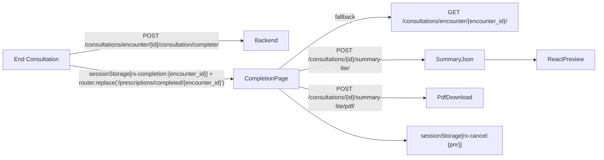

# CONSULTATION COMPLETION WORKSPACE PLAN

## Objective

Replace the current End Consultation completion behavior from:

- preview popup tab + dashboard redirect

to:

- redirect to `/prescriptions/completed/{encounter_id}`
- final locked prescription workspace
- auto-download PDF once
- print/cancel/continue workflow actions
- refresh-safe direct link support

## Final Flow

1. Doctor clicks End Consultation.
2. Frontend posts to `/consultations/encounter/{id}/consultation/complete/`.
3. Frontend stores `sessionStorage["rx-completion:{encounter_id}"]`.
4. Frontend redirects to `/prescriptions/completed/{encounter_id}`.
5. Completion page resolves `consultation_id` from session or `GET /consultations/encounter/{encounter_id}/`.
6. Completion page loads summary JSON from `/consultations/{id}/summary-lite/`.
7. Completion page renders React prescription preview.
8. Completion page auto-downloads `/consultations/{id}/summary-lite/pdf/` once per encounter.

## Architecture

## Backend Scope

- Reuse existing encounter detail endpoint:
  - `GET /consultations/encounter/{encounter_id}/`
  - consumes `consultation_id`, `status`, `consultation_end_time`, `visit_pnr`
- No schema changes.
- No cancel API in phase 1.

## Frontend Scope

- New route:
  - `Hospital-Web-UI/medixpro/medixpro/app/(dashboard)/prescriptions/completed/[encounterId]/page.tsx`
  - `Hospital-Web-UI/medixpro/medixpro/app/(dashboard)/prescriptions/completed/[encounterId]/loading.tsx`
- New components:
  - `Hospital-Web-UI/medixpro/medixpro/components/prescriptions/prescription-preview.tsx`
  - `Hospital-Web-UI/medixpro/medixpro/components/prescriptions/prescription-success-header.tsx`
  - `Hospital-Web-UI/medixpro/medixpro/components/prescriptions/prescription-actions-sidebar.tsx`
  - `Hospital-Web-UI/medixpro/medixpro/components/prescriptions/cancel-prescription-modal.tsx`
  - `Hospital-Web-UI/medixpro/medixpro/components/prescriptions/start-next-consultation-section.tsx`
- End Consultation handoff updated in:
  - `Hospital-Web-UI/medixpro/medixpro/components/consultations/consultation-action-bar.tsx`

## UX Decisions

- Keep existing app shell/layout.
- 75/25 split (`lg:col-span-3` + `lg:col-span-1`), stacked on smaller screens.
- Sticky success header and sticky right actions panel.
- PNR shown in completion metadata, encounter id not shown.
- Preview is locked/read-only with explicit lock note.
- Cancel is frontend-only state (status + watermark + action disable).

## Future-ready notes

- Cancel flow includes TODO hook for future backend endpoint:
  - `POST /consultations/prescription/{id}/cancel/`
- Remaining roadmap (out of phase 1):
  - WhatsApp sharing
  - patient app sync
  - timeline/audit views
  - digital signatures
  - repeat prescription workflows
