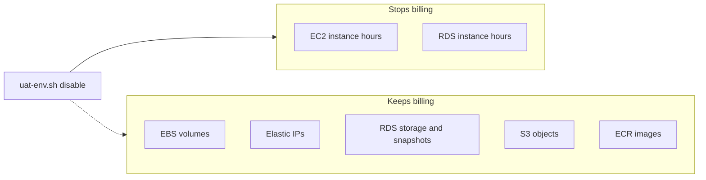

# UAT AWS environment enable / disable (cost control)

**Scope:** laptop AWS CLI scripts that **start** or **stop** the HOS UAT stack in `ap-south-1` so compute is billed only while the team is testing. Production (`hos-prod-*`) is never in scope.

**Related:** first UAT layout in [aws_first_uat_deploy_b6d6d66d.plan.md](aws_first_uat_deploy_b6d6d66d.plan.md). App deploy on the hosts stays [deploy-uat.sh](../../Hospital-Management-API/scripts/deploy-uat.sh) / frontend `deploy-uat.sh`. This plan only covers **power on / power off**.

---

## 1. Goal

UAT is a test environment. Leaving two EC2s and RDS running 24/7 is the largest avoidable bill. The operator (admin IAM on a laptop) should be able to:

```bash
./scripts/aws/uat-env.sh status    # what is on, what still costs money
./scripts/aws/uat-env.sh enable    # start RDS, then both EC2s, wait, health-check
./scripts/aws/uat-env.sh disable   # stop both EC2s, then RDS
```

Typical pattern: **enable in the morning when UAT work starts, disable at end of day / over weekends.**

Do **not** terminate instances, delete RDS, empty S3, or release Elastic IPs on disable. Those actions save a bit more money but destroy data or change public addresses.

---

## 2. What UAT actually bills (and what stop saves)

From the first-UAT plan, the billable UAT set is:

| Resource | Suggested name | While **enabled** | After **disable** (stop, not delete) |
| --- | --- | --- | --- |
| EC2 frontend | `hos-uat-web-01` (`t3.small`) | Instance hours | **$0 compute.** EBS gp3 still bills. |
| EC2 backend | `hos-uat-api-01` (`t3.medium`) | Instance hours | **$0 compute.** EBS gp3 still bills. |
| RDS PostgreSQL | `hos-uat-postgres` (Single-AZ `db.t3.micro` / `db.t3.small`) | Instance hours | **$0 instance hours.** Allocated storage + snapshots still bill. |
| Elastic IPs (2) | one per EC2 | Public IPv4 (~$0.005/IP/hour) | **Still bills** if the addresses stay allocated. Keep them so URLs/DNS do not change. |
| S3 | `hos-uat-media-<account-id>` | Storage + requests | **Still bills.** You cannot “stop” a bucket. Storage for UAT reports is cheap; do not delete. |
| EBS volumes | root disks on both EC2s | Always | **Always.** Stopping EC2 does not stop EBS charges. |
| ECR `hos-api` / `hos-web` | image storage | Always (small) | Leave images; they are required to start Compose again. |
| SSM `/hos/uat/*` | parameters | Negligible | Leave in place. |
| CloudWatch logs | `/hos/uat/*` | Ingestion + storage | Leave; set retention (14–30 days) if the log bill grows. |
| NAT Gateway | **must not exist for UAT** | ~$32+/month if present | Status script must **warn**. First-UAT plan uses public subnet + EIP, no NAT. |

Indicative **Mumbai (`ap-south-1`)** monthly order of magnitude (On-Demand, 730 hours). Confirm in AWS Cost Explorer; these are planning numbers, not a quote.

| Item | 24/7 on | Mostly off (≈40 work hours/week ≈ 24% uptime) |
| --- | --- | --- |
| `t3.small` + `t3.medium` compute | ~$51 | ~$12 |
| `db.t3.micro` compute | ~$13 | ~$3 |
| Two public IPv4 / EIPs | ~$7 | ~$7 (kept allocated) |
| EBS (~40 GB web + ~60 GB api) | ~$9 | ~$9 |
| RDS storage + 7-day backups | ~$3–8 | ~$3–8 |
| S3 UAT objects | usually <$5 | same |
| **Rough total** | **~$85–100** | **~$35–45** |

**The saving is EC2 + RDS compute**, typically **$50–65/month** if UAT is off nights and weekends. S3 and Elastic IPs are not the main leak. A forgotten **NAT Gateway** or a UAT RDS that **auto-starts after 7 days** (see below) will wipe out the saving.



---

## 3. Decision: stop, do not tear down

| Approach | When to use | Cost | Risk |
| --- | --- | --- | --- |
| **A. Stop EC2 + stop RDS** (chosen) | Daily / weekly UAT on-off | Best balance | Data, EIPs, SSM, Docker images all stay. Enable is minutes, not a redeploy. |
| B. Terminate EC2, snapshot RDS, delete RDS | UAT unused for weeks | Slightly cheaper (no EBS) | Hours to rebuild hosts, Docker, Compose; EIP may change unless DNS is used. |
| C. Empty or Glacier S3 | Almost never for UAT | Cents | Breaks report downloads and test evidence. |

Compose on UAT already uses `restart: unless-stopped`. After an EC2 stop/start, Docker comes back with the last containers **if** Docker is enabled on boot (standard Ubuntu + Docker Engine install in the first-UAT plan). Enable still starts **RDS first** so Django is not hammering a stopped database.

---

## 4. Hard rules

1. **Never** pass production names (`hos-prod-*`, `/hos/production/*`, `hos-prod-postgres`) into this script.
2. Discover resources by **explicit allowlist** (Name tags / RDS identifier), not “every instance in the account”.
3. Require tag `Environment=uat` on EC2 and RDS before stop/start. If a matching name is missing the tag, **abort**.
4. Default region `ap-south-1`.
5. Print `aws sts get-caller-identity` (account + user) and require `--yes` (or an interactive confirm) before mutating.
6. `--dry-run` prints the AWS CLI calls and does not call stop/start.
7. Disable order: **EC2 first, then RDS** (no app writes to a stopping database).
8. Enable order: **RDS first (wait `available`), then EC2** (wait `running`), then HTTP health check.
9. Do not disassociate Elastic IPs on disable. Re-allocating them changes `http://<eip>/` and SSM `ALLOWED_HOSTS` / `BACKEND_PROXY_TARGET` until DNS exists.
10. Do not touch S3 objects, IAM, security groups, or Parameter Store.

---

## 5. RDS 7-day auto-start (must handle)

AWS **restarts a stopped RDS instance after 7 days** so maintenance is not skipped. If nobody re-runs `disable`, you pay RDS hours again.

**Phase 1 (this plan):** `disable` prints a reminder. Operator re-runs `disable` if UAT stays off more than 6 days, or uses `status` on Monday.

**Phase 2 (optional, after Phase 1 is in daily use):** EventBridge + Lambda (or a scheduled laptop cron) that stops `hos-uat-postgres` when it is `available` **and** a tag such as `hos:desired-state=stopped` is set. Clear that tag on `enable`. This is the [AWS-documented pattern](https://repost.aws/knowledge-center/rds-stop-seven-days) for keeping RDS stopped longer than a week.

Do **not** delete the UAT database to dodge the 7-day rule unless the team accepts a full restore-from-snapshot on every enable.

---

## 6. S3: reduce cost without “disabling”

S3 has no stop button. For UAT:

- Keep the private bucket. Object storage is small next to EC2/RDS.
- Enable **versioning lifecycle**: expire noncurrent versions after 30 days (first-UAT plan already called for lifecycle on old versions).
- Abort incomplete multipart uploads after 7 days.
- Do **not** put UAT reports in Glacier if testers need the same objects the next morning.

`status` should print bucket size (`aws s3 ls s3://$BUCKET --recursive --summarize`) so the team can see if media growth is becoming real money.

---

## 7. Tagging (do this when creating UAT, or once on existing resources)

Apply before the script is used:

| Key | Value |
| --- | --- |
| `Project` | `hos` |
| `Environment` | `uat` |
| `Name` | `hos-uat-web-01` / `hos-uat-api-01` / `hos-uat-postgres` |
| `hos:managed-by` | `uat-env-script` |

Console one-liners (replace instance / RDS ids):

```bash
export AWS_REGION=ap-south-1

aws ec2 create-tags --region "$AWS_REGION" --resources i-xxxxxxxx i-yyyyyyyy --tags \
  Key=Project,Value=hos Key=Environment,Value=uat Key=hos:managed-by,Value=uat-env-script

aws rds add-tags-to-resource --region "$AWS_REGION" \
  --resource-name "arn:aws:rds:${AWS_REGION}:<account-id>:db:hos-uat-postgres" \
  --tags Key=Project=hos Key=Environment=uat Key=hos:managed-by=uat-env-script
```

---

## 8. Script design (run from laptop, admin IAM)

| Path | Role |
| --- | --- |
| [scripts/aws/uat-env.sh](../../scripts/aws/uat-env.sh) | `status` / `enable` / `disable` |
| [scripts/aws/uat-env.env.example](../../scripts/aws/uat-env.env.example) | Copy to `uat-env.env` (gitignored) with real names |

**Prerequisites on the laptop**

- AWS CLI v2
- Admin (or a dedicated `hos-uat-operator` IAM policy: `ec2:Start/Stop/DescribeInstances`, `rds:Start/Stop/DescribeDBInstances`, `ec2:DescribeAddresses`, `s3:ListBucket` on the UAT bucket only)
- `AWS_PROFILE` or env credentials; region `ap-south-1`

**Config** (`uat-env.env`, not committed):

```bash
AWS_REGION=ap-south-1
UAT_EC2_NAME_TAGS=hos-uat-web-01,hos-uat-api-01
UAT_RDS_INSTANCE_ID=hos-uat-postgres
UAT_S3_BUCKET=hos-uat-media-123456789012
UAT_API_HEALTH_URL=http://<api-eip>/health/
```

**Commands the script wraps**

Disable:

```bash
aws ec2 stop-instances --instance-ids <web> <api>
aws ec2 wait instance-stopped --instance-ids <web> <api>
aws rds stop-db-instance --db-instance-identifier hos-uat-postgres
```

Enable:

```bash
aws rds start-db-instance --db-instance-identifier hos-uat-postgres
aws rds wait db-instance-available --db-instance-identifier hos-uat-postgres
aws ec2 start-instances --instance-ids <web> <api>
aws ec2 wait instance-running --instance-ids <web> <api>
curl -fsS "$UAT_API_HEALTH_URL"
```

Optional on disable: `--snapshot` takes `hos-uat-postgres-pre-stop-YYYYmmddHHMM` before stop. Not required every night.

**Expected timings:** RDS start 2–8 minutes; EC2 start 1–2 minutes; first HTTP 200 may need another 1–2 minutes while Compose/`unless-stopped` comes up. If health fails, SSM into `hos-uat-api-01` and check `docker compose ps` — do not re-run a full `deploy-uat.sh` unless images/containers are gone.

---

## 9. Operator runbook

### First-time setup

1. Install/configure AWS CLI; `aws sts get-caller-identity` shows the intended account.
2. Confirm UAT resources exist (or finish the first-UAT Console plan) and tags in section 7.
3. Copy `scripts/aws/uat-env.env.example` → `scripts/aws/uat-env.env` and fill EIPs/bucket.
4. `./scripts/aws/uat-env.sh status --dry-run` then `status`.

### Each work session

```bash
cd /path/to/HOS_API
./scripts/aws/uat-env.sh enable --yes
# test on http://<web-eip>/ and http://<api-eip>/health/
```

### End of day / weekend

```bash
./scripts/aws/uat-env.sh disable --yes
./scripts/aws/uat-env.sh status
```

### If UAT stays off more than 6 days

Run `status`. If RDS is `available` again, run `disable`.

### After enable, app not healthy

1. Wait for RDS `available` and EC2 `running` + status checks `ok`.
2. Session Manager → `hos-uat-api-01` → `docker compose ps` and `curl -sS http://127.0.0.1/health/`.
3. Only then consider `./scripts/deploy-uat.sh` on the host (that rebuilds/pushes; it is not part of power-on).

---

## 10. What this does not do

- Does not create VPC, EC2, RDS, S3, or IAM (that remains Console / first-UAT plan).
- Does not deploy application code (still `deploy-uat.sh` on each host).
- Does not start/stop production.
- Does not delete S3, ECR, snapshots, or Parameter Store.
- Does not replace Cost Explorer / billing alarms — keep those from Phase 1 of the first-UAT plan.

---

## 11. Implementation checklist

1. Tag UAT EC2 + RDS (`Environment=uat`, `Name=hos-uat-*`).
2. Add `scripts/aws/uat-env.sh` with `status | enable | disable`, `--dry-run`, `--yes`, prod-name guard, tag guard.
3. Add `scripts/aws/uat-env.env.example`; gitignore `uat-env.env`.
4. Document NAT warning in `status` (`aws ec2 describe-nat-gateways` filtered by `hos-uat` name/tag).
5. Smoke: dry-run → disable → status (EC2 stopped, RDS stopping/stopped) → enable → `/health/` 200.
6. Optional later: EventBridge RDS re-stop (section 5, Phase 2) and S3 noncurrent-version lifecycle (section 6).

---

## 12. IAM note for a non-admin operator (optional)

Admin on the laptop is enough to start. If you later split duties, grant only:

- `ec2:DescribeInstances`, `ec2:StartInstances`, `ec2:StopInstances`, `ec2:DescribeAddresses`, `ec2:DescribeNatGateways`, `ec2:DescribeInstanceStatus` on instances tagged `Environment=uat`
- `rds:DescribeDBInstances`, `rds:StartDBInstance`, `rds:StopDBInstance`, `rds:ListTagsForResource` on `hos-uat-postgres`
- `s3:ListBucket`, `s3:GetBucketLocation` on the UAT bucket
- `sts:GetCallerIdentity`

Use condition keys `ec2:ResourceTag/Environment=uat` so a typo cannot stop production.
