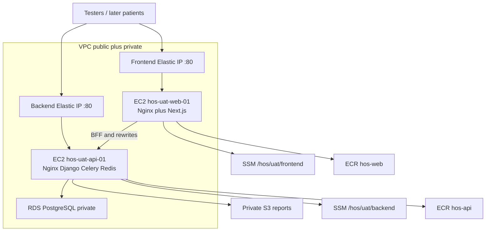

# First AWS deployment — UAT now, production later (same pattern)

Docker Compose for local/dev is done. **Code goes to `hos-uat` first**, then AWS UAT infra, then deploy from that branch. Production is the same checklist with different names, no shared data, after UAT approval.

**Until a domain exists:** Elastic IPs and **HTTP**. Do not wait on Route 53 or Let’s Encrypt.

**Account:** one AWS account, region `ap-south-1`. UAT and prod never share RDS, S3, Redis, SSM, or EC2s.

## How we will operate AWS (console vs SDK)

**Recommendation: AWS Console for the first UAT infrastructure. Do not write an AWS SDK (boto3) bootstrap for this launch.**

| Work | Tool | Why |
| --- | --- | --- |
| VPC, SGs, IAM roles, ECR, RDS, S3, EC2, Elastic IPs, SSM parameters | **AWS Console** | First-time setup, few dozen clicks, you can *see* each resource. SDK scripts take longer to write and debug than creating UAT once. |
| Login to servers | **SSM Session Manager** in the Console (or AWS CLI `aws ssm start-session`) | No public SSH. |
| Build/push images, migrate, start Compose | **Existing `./scripts/deploy-uat.sh` on the EC2** | Already talks to ECR and SSM via AWS CLI. That is the “SDK” we already have. |
| Repeat prod later | Console again **or** Terraform after UAT is proven | Copy the UAT click-path. Automate only if you will recreate this often. |

Keep a notepad of every name, AZ, EIP, and RDS endpoint while clicking. Production follows the same names with `hos-prod-*`.

IAM for **you** (laptop/console): one admin user with access keys **or** SSO. IAM for **EC2**: instance roles only — no long-lived keys on the servers.

## Git order (do this before creating EC2s)

1. Finish the SSM path split on `hos-development` and confirm local Docker still works.
2. Promote, then AWS hosts always `git checkout hos-uat`:

```bash
cd /path/to/HOS_API
git checkout hos-uat
git pull origin hos-uat
git merge hos-development
git push origin hos-uat
```

3. Create UAT AWS resources (Console).
4. On each EC2, clone the repo and stay on `hos-uat` for every deploy.

Do not deploy AWS from `hos-development`. Do not create EC2s before the branch exists and contains the Compose/deploy scripts.

## UAT cheaper vs prod zone

AWS **does not price AZs differently** in the same region (`ap-south-1a` vs `ap-south-1b` cost the same). UAT savings come from **size and Single-AZ**, not from picking a “cheap AZ”.

| Choice | UAT (testing only) | Production |
| --- | --- | --- |
| Region | `ap-south-1` | `ap-south-1` (same region unless you later decide otherwise) |
| Availability Zone | **One AZ**, e.g. `ap-south-1a` — all UAT EC2 + RDS in that AZ | **Your preferred AZ**, e.g. `ap-south-1b`, so UAT and prod do not share one AZ failure |
| RDS | **Single-AZ**, 7-day backups, `db.t3.micro` or `db.t3.small` | Single-AZ first is fine; Multi-AZ later if you need failover. Larger instance. |
| EC2 | `t3.small` web, `t3.medium` api | `t3.medium` web, `t3.large` api (adjust after load) |
| NAT Gateway | **Avoid** — put both EC2s in a public subnet with EIP (default VPC). NAT is expensive for UAT. | Same pattern unless you require private EC2s |
| Other | No ALB, no ElastiCache, no extra EIP unused | Same until stable |

Prod in a **different AZ** than UAT is a good idea (blast radius), not a cost play.



| Piece | UAT (do this first) | Production (same steps later) |
| --- | --- | --- |
| Git | `hos-uat` | `main` |
| Frontend host | `hos-uat-web-01` + EIP | `hos-prod-web-01` + EIP |
| Backend host | `hos-uat-api-01` + EIP | `hos-prod-api-01` + EIP |
| App URLs (no domain) | `http://<web-eip>/` and `http://<api-eip>/` | same pattern until DNS |
| App URLs (with domain) | `https://uat-app.<domain>` / `https://uat-api.<domain>` | `https://app.<domain>` / `https://api.<domain>` |
| Images | Build `hos-api:<sha>` and `hos-web:<sha>-uat` | **API:** pull UAT SHA. **Web:** rebuild `<sha>-production` |
| Data | UAT RDS + UAT S3 | separate prod RDS + prod S3 |

---

## Phase 0 — Gate (already true locally)

- Backend Compose healthy on `:8000`, frontend Docker healthy on `:3000`.
- BFF uses `host.docker.internal` locally; UAT/prod use the API hostname or EIP, not `host.docker.internal`.
- Scripts exist: [deploy-uat.sh](HOS_API/Hospital-Management-API/scripts/deploy-uat.sh), [deploy-production.sh](HOS_API/Hospital-Management-API/scripts/deploy-production.sh), frontend [deploy-uat.sh](HOS_API/Hospital-Web-UI/medixpro/medixpro/scripts/deploy-uat.sh) / [deploy-production.sh](HOS_API/Hospital-Web-UI/medixpro/medixpro/scripts/deploy-production.sh).

**One code fix before first UAT deploy:** backend `write_env_from_ssm "/hos/uat"` is recursive, so `/hos/uat/frontend/*` would leak into Django’s env and can overwrite `NGINX_SERVER_NAME`. Change UAT/prod backend scripts to `/hos/uat/backend` and `/hos/production/backend`. Frontend already reads `/hos/uat/frontend`.

---

## Phase 1 — AWS account and region (Console)

**Why:** billing, MFA, and a human deploy identity before any billable resources.

1. Sign in to the AWS Console; switch region to **Mumbai (`ap-south-1`)**.
2. Root MFA on; do not deploy as root.
3. Create your admin IAM user (console access). CLI on your laptop is optional; EC2 uses the instance role.
4. Billing alerts + CloudTrail in this region.

---

## Phase 2 — Network (VPC)

**Why:** RDS must not be on the internet; EC2s need outbound HTTPS for ECR/SSM/S3.

1. Use the **default VPC** for first UAT (fastest, no NAT bill). Create UAT EC2s in **one AZ** (e.g. `ap-south-1a`).
2. RDS in the **same AZ**, private (not publicly accessible). If the default VPC has no private subnet, still set RDS “not publicly accessible” and lock it with `hos-uat-db-sg`.
3. Production later: same VPC or a second VPC; place prod EC2+RDS in **your preferred AZ** (e.g. `ap-south-1b`).

UAT sizes: frontend `t3.small`, backend `t3.medium`, RDS `db.t3.micro`/`db.t3.small`. Prod: step up after UAT load is known.

---

## Phase 3 — Security groups

**Why:** only 80/443 public; Postgres only from the API box; Redis never published.

| Group | Inbound |
| --- | --- |
| `hos-uat-web-sg` | TCP 80 (and later 443) from `0.0.0.0/0`. No SSH. |
| `hos-uat-api-sg` | TCP 80/443 from internet **and** from `hos-uat-web-sg` (frontend BFF). No 8000/6379/5432 public. |
| `hos-uat-db-sg` | TCP 5432 **only** from `hos-uat-api-sg`. |

Admin access: **SSM Session Manager** (no public port 22). Same three groups with `hos-prod-*` names for production.

---

## Phase 4 — IAM roles (instance profiles)

**Why:** EC2 must pull images and secrets without access keys on disk.

- `hos-uat-web-role`: `ssm:GetParametersByPath` on `/hos/uat/frontend/*`; ECR pull `hos-web`; CloudWatch logs.
- `hos-uat-api-role`: SSM `/hos/uat/backend/*`; ECR pull/push `hos-api`; S3 read/write **UAT bucket only**; CloudWatch; RDS describe/snapshot (prod script).

No role may read the other environment’s SSM path or S3 bucket.

---

## Phase 5 — ECR

**Why:** UAT builds and pushes; prod API pulls the same SHA.

1. Create repositories `hos-api` and `hos-web` in `ap-south-1`.
2. Note registry: `ACCOUNT.dkr.ecr.ap-south-1.amazonaws.com`.
3. Lifecycle: keep last N tagged images (optional).

---

## Phase 6 — RDS PostgreSQL (UAT)

**Why:** Compose Postgres is local-only; AWS uses RDS.

1. Console → RDS → create `hos-uat-postgres`: PostgreSQL 16, **Single-AZ** in the UAT AZ, **not publicly accessible**, encryption, 7-day backups, SG = `hos-uat-db-sg`. Do not enable Multi-AZ on UAT.
2. Create database/user; store password only in SSM.
3. Take a manual snapshot after first successful migrate.
4. Production later: `hos-prod-postgres`, deletion protection on, longer backup retention.

---

## Phase 7 — S3

**Why:** reports/uploads must not live on EC2.

1. Bucket `hos-uat-media-<account-id>`: block public access, encryption, versioning, lifecycle on old versions.
2. Production: `hos-prod-media-<account-id>`.
3. Point `AWS_REPORTS_BUCKET` / storage backend at this bucket in SSM.

---

## Phase 8 — Parameter Store (no domain yet)

**Why:** deploy scripts render `/etc/hos/uat.env` and `/etc/hos-web/uat.env` from SSM. Do not commit filled `.env.uat`.

Create **SecureString** parameters. Use Elastic IPs after Phase 9; you can create placeholders first and update values once EIPs exist.

**Backend `/hos/uat/backend/`** (from [.env.uat.example](HOS_API/Hospital-Management-API/.env.uat.example)):

- `DJANGO_SETTINGS_MODULE=main.settings.uat`
- `SECRET_KEY`, `DEBUG=false`
- `ALLOWED_HOSTS=<api-eip>` (later `uat-api.<domain>`)
- `CORS_ALLOWED_ORIGINS=http://<web-eip>` (later `https://uat-app.<domain>`)
- `CSRF_TRUSTED_ORIGINS` same as CORS
- `DB_*` → UAT RDS endpoint
- `REDIS_URL=redis://redis:6379/1` (Compose overlay can still force this)
- `AWS_REPORTS_BUCKET`, `AWS_REGION=ap-south-1`
- `SECURE_SSL_REDIRECT=false` until TLS exists
- `NGINX_SERVER_NAME=<api-eip>` (or `_` if the Nginx template requires a name)

**Frontend `/hos/uat/frontend/`** (from [.env.uat.example](HOS_API/Hospital-Web-UI/medixpro/medixpro/.env.uat.example)):

- `NGINX_SERVER_NAME=<web-eip>`
- `BACKEND_PROXY_TARGET=http://<api-eip>` (no `/api`; rebuild image if this changes)
- `DJANGO_API_URL=http://<api-eip>/api/`

When the domain exists, change these to `https://uat-app.` / `https://uat-api.`, set `SECURE_SSL_REDIRECT=true`, rebuild **frontend** (proxy target is bake-time), recreate backend env, add certs.

Production copies the same keys under `/hos/production/backend` and `/hos/production/frontend`.

---

## Phase 9 — EC2 + Elastic IPs

**Why:** two hosts matching the target architecture.

For **each** of `hos-uat-web-01` and `hos-uat-api-01`:

1. Ubuntu LTS, encrypted gp3 disk (30–50 GB web, 40–80 GB api), correct SG + IAM role, public subnet.
2. Allocate an Elastic IP and associate it. Record both IPs; patch SSM (Phase 8).
3. Install Docker Engine, Docker Compose v2, AWS CLI, SSM agent, CloudWatch agent.
4. Confirm Session Manager connect (no SSH).
5. Clone the repo (deploy key or HTTPS + IAM is fine); checkout `hos-uat`.

Frontend Nginx TLS volume can stay empty on HTTP. Backend Redis stays on Docker network only.

---

## Phase 10 — First UAT software deploy

**Order: RDS reachable → backend → frontend.** Branch `hos-uat`.

On **API** EC2:

```bash
cd Hospital-Management-API
export AWS_REGION=ap-south-1
export ECR_REGISTRY=<account>.dkr.ecr.ap-south-1.amazonaws.com
export ECR_REPOSITORY=hos-api
export NGINX_SERVER_NAME=<api-eip>
./scripts/deploy-uat.sh
```

This writes `/etc/hos/uat.env`, builds/pushes `hos-api:<sha>`, migrates, collectstatic, starts Redis/API/Celery/Nginx. Check `http://<api-eip>/health/` → JSON 200.

On **WEB** EC2:

```bash
cd Hospital-Web-UI/medixpro/medixpro
export AWS_REGION=ap-south-1
export ECR_REGISTRY=<account>.dkr.ecr.ap-south-1.amazonaws.com
export ECR_REPOSITORY=hos-web
./scripts/deploy-uat.sh
```

Rebuilds Next with UAT `BACKEND_PROXY_TARGET`, pushes `hos-web:<sha>-uat`. Check `http://<web-eip>/` and login; DevTools must stay on the **frontend** origin `/api/...`.

Smoke: login OTP, one clinic/API call, one report upload to UAT S3, queue WebSocket if used (`/ws/` via Next rewrite to API EIP).

Record the Git SHA. That SHA is what production API will pull.

---

## Phase 11 — Domain and TLS (when you have them)

1. Route 53 (or current DNS): `uat-app` → web EIP, `uat-api` → api EIP.
2. Let’s Encrypt on both Nginx containers (`fullchain.pem` / `privkey.pem` in the cert volume).
3. Update SSM to `https://...`, CORS/CSRF/ALLOWED_HOSTS, `SECURE_SSL_REDIRECT=true`.
4. Redeploy backend (env only). **Rebuild frontend** (proxy target changed).
5. Redirect HTTP → HTTPS.

Do this on UAT first; production should launch with DNS+TLS if the domain is ready, otherwise same EIP+HTTP as UAT (not ideal for real patients).

---

## Phase 12 — Production (same plan, new names)

After UAT sign-off:

1. Repeat Phases 2–9 as `hos-prod-*` (new SG, RDS, S3, SSM, two EC2s, two EIPs). **Empty database.**
2. Merge `hos-uat` → `main`.
3. On prod **API** EC2: `HOS_IMAGE_TAG=<uat-sha>` and `./scripts/deploy-production.sh` (pull, RDS snapshot, migrate, **no rebuild**).
4. On prod **WEB** EC2: `APPROVED_SHA=<uat-sha>` and `./scripts/deploy-production.sh` (**rebuild** with prod `BACKEND_PROXY_TARGET`).
5. Tag `vMAJOR.MINOR.PATCH`. GitHub Release with SHA, migration notes, rollback tag.

Rollback: API = previous image tag + same script. Frontend = previous `*-production` tag. RDS restore only with approval.

---

## Phase 13 — Operations (light)

- CloudWatch log groups `/hos/uat/backend`, `/hos/uat/frontend` (and prod equivalents).
- Alarms: EC2 status, disk, CPU, RDS storage, 5xx.
- Daily: errors + failed Celery. Weekly: backups. Monthly: OS/Docker patches.
- To keep UAT cheap when testers are not working, stop (do not delete) UAT EC2 + RDS from a laptop using [UAT_AWS_ENV_ENABLE_DISABLE_PLAN.md](UAT_AWS_ENV_ENABLE_DISABLE_PLAN.md) and `scripts/aws/uat-env.sh`. Never point that script at production.

**Out of scope for first launch:** ALB, ACM, ECS, ElastiCache, CloudFront, Multi-AZ RDS. Add after UAT+prod are stable.

---

## Execution order (checklist)

1. SSM path split on `hos-development` (`/hos/{env}/backend` vs `frontend`).
2. Merge `hos-development` → `hos-uat` and push.
3. Console: account, MFA, billing, region `ap-south-1`.
4. Console: default VPC, **one AZ**, three security groups.
5. Console: IAM instance roles.
6. Console: ECR `hos-api` + `hos-web`.
7. Console: UAT Single-AZ RDS + UAT S3.
8. Console: two UAT EC2s in that AZ + EIPs; Session Manager; install Docker.
9. Console: SSM parameters with EIP URLs (`SECURE_SSL_REDIRECT=false`).
10. On EC2s (Session Manager): `git checkout hos-uat`, backend `deploy-uat.sh`, then frontend `deploy-uat.sh`; smoke test.
11. Optional: domain + TLS.
12. Prod: Console copy in the **preferred AZ**; pull API SHA; rebuild frontend; tag.

The existing [aws-production-deployment-runbook.md](HOS_API/docs/aws-production-deployment-runbook.md) is still **one backend EC2**. After this launch works, update that runbook to the two-EC2 + Console + EIP-until-DNS model.

The existing [aws-production-deployment-runbook.md](HOS_API/docs/aws-production-deployment-runbook.md) is still **one backend EC2**. After this launch works, update that runbook to the two-EC2 + EIP-until-DNS model so UAT and prod share one document.
